<p align="center">
  
</p>

<p align="center">
  <strong>Patent Pending</strong> &nbsp;|&nbsp; <a href="LICENSE">MIT License</a> &nbsp;|&nbsp; <a href="https://github.com/JosephOIbrahim/Harlo/blob/main/PATENTS.md">Patent Details</a>
</p>

# Comfy Cozy

**Talk to ComfyUI like a colleague. It talks back.**

You describe what you want in plain English. The agent loads workflows, swaps models, tweaks parameters, installs missing nodes, runs generations, analyzes outputs, and learns what works for you -- all without you touching JSON or hunting through menus. It doesn't ask permission -- it makes the change, reports what it did, and every change is undoable.

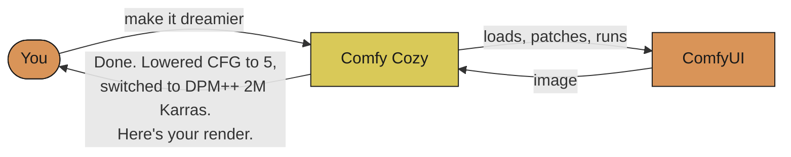

> **Session 1** is a capable tool.<br/>
> **Session 100** is a capable tool that knows your style.

> **TL;DR**
> - Plain-English co-pilot for ComfyUI. You describe the change; the agent loads workflows, swaps models, patches parameters, runs generations, evaluates output.
> - **113 MCP tools** across **4 LLM providers** — Claude, GPT-4o, Gemini, Ollama. Swap providers with one env var.
> - Every mutation is a **reversible delta layer** (LIVRPS). Full undo stack. Nothing destructive lands without your say-so.
> - **Experience persists.** Session 1 ships with built-in knowledge. After ~30 runs the agent starts biasing toward what's actually worked for you.
> - Ships three ways: **inside Claude Code/Desktop (MCP)**, **standalone CLI**, **native ComfyUI sidebar**. Pick one.

---

## See It In Action

| You say | What happens |
|---------|-------------|
| *"Load my portrait workflow and make it dreamier"* | Loads the file, lowers CFG, switches sampler, saves with full undo |
| *"I want to use Flux"* | Searches CivitAI + HuggingFace, downloads the model, wires it into your workflow |
| *"Repair this workflow"* | Finds missing nodes, installs the packs, fixes connections, migrates deprecated nodes |
| *"Run this with 30 steps"* | Patches the workflow, validates it, queues it to ComfyUI, shows progress |
| *"Analyze this output"* | Uses Vision AI to diagnose issues and suggest parameter changes |
| *"What model should I use for anime?"* | Searches CivitAI + HuggingFace + your local models, recommends the best fit |
| *"Optimize this for speed"* | Profiles GPU usage, checks TensorRT eligibility, applies optimizations |
| *"Repair and run this"* | Finds missing nodes, installs them, validates, executes -- no confirmation needed |

---

## Sponsor This Project

Comfy Cozy is production software. 4,180+ tests (all mocked, runnable in under a minute) cover the 113 MCP tools that drive the workflow lifecycle end-to-end. Four LLM providers — Anthropic, OpenAI, Gemini, Ollama — sit behind a single abstraction with parity across all four. The [CHANGELOG](CHANGELOG.md) tracks active hardening and new work.

If Comfy Cozy saves you time inside ComfyUI, sponsorship is the most direct way to keep it moving.

**Sponsorship funds:**

- Continued development of the MCP agent layer
- Priority response on sponsor-filed issues
- New intelligence-layer tools — vision evaluators, provisioning, planning

A separate Pro tier with additional offerings is planned. Details when it's ready, not before.

[**Become a sponsor →**](https://github.com/sponsors/JosephOIbrahim) &nbsp;·&nbsp; [Acknowledgments](SPONSORS.md)

---

## Get Running

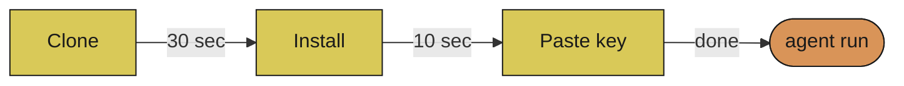

**Three prerequisites, four copy-paste steps. Under 2 minutes start to finish.**

| | What you need | Where to get it | Time |
|---|------|-----------------|------|
| 1 | **Python 3.11+** | [python.org/downloads](https://python.org/downloads) | already have it? skip |
| 2 | **ComfyUI running** | [github.com/comfyanonymous/ComfyUI](https://github.com/comfyanonymous/ComfyUI) | already have it? skip |
| 3 | **One LLM backend** | API key (Anthropic / OpenAI / Google) OR [Ollama](https://ollama.com) (free, local, no key) | 1 min to grab a key |

**Already have all three? Copy-paste these four blocks. That's it.**

### 1. Clone

```bash
git clone https://github.com/JosephOIbrahim/Comfy-Cozy.git
cd Comfy-Cozy
```

### 2. Install

```bash
pip install -e .
```

One command. No build step. No Docker. No conda. Just pip.

<details>
<summary>Want the test suite too? (optional, click to expand)</summary>

```bash
pip install -e ".[dev]"           # + 4,100+ passing tests
pip install -e ".[dev,stage]"     # + USD stage subsystem (~200MB, most users skip)
```

</details>

### 3. API key

```bash
cp .env.example .env
```

Open `.env` in any text editor, paste your key on the first line:

```bash
ANTHROPIC_API_KEY=sk-ant-your-key-here
```

<details>
<summary>Using OpenAI, Gemini, or Ollama instead? (click to expand)</summary>

Pick one block, paste into `.env`:

```bash
# --- OpenAI ---
LLM_PROVIDER=openai
OPENAI_API_KEY=sk-your-key-here
# first time only: pip install openai

# --- Gemini ---
LLM_PROVIDER=gemini
GEMINI_API_KEY=your-key-here
# first time only: pip install google-genai

# --- Ollama (fully local, free, no key) ---
LLM_PROVIDER=ollama
AGENT_MODEL=llama3.1
# first time only: ollama pull llama3.1
```

</details>

<details>
<summary>ComfyUI installed somewhere non-default? (click to expand)</summary>

Add one more line to `.env`:

```
COMFYUI_DATABASE=C:/path/to/your/ComfyUI
```

</details>

### Step 4 of 4 -- Go

```bash
agent run
```

Type what you want. Type `quit` when you're done.

---

## Connect the Sidebar to ComfyUI

The agent also lives **inside ComfyUI** as a native sidebar panel. To enable it, create two symlinks from ComfyUI's `custom_nodes/` folder to Comfy-Cozy:

**Windows (run as Administrator):**

```cmd
cd C:\path\to\ComfyUI\custom_nodes
mklink /D comfy-cozy-panel C:\path\to\Comfy-Cozy\panel
mklink /D comfy-cozy-ui C:\path\to\Comfy-Cozy\ui
```

**Linux / macOS:**

```bash
cd /path/to/ComfyUI/custom_nodes
ln -s /path/to/Comfy-Cozy/panel comfy-cozy-panel
ln -s /path/to/Comfy-Cozy/ui comfy-cozy-ui
```

Restart ComfyUI. The Comfy Cozy chat panel appears in the **left sidebar**.

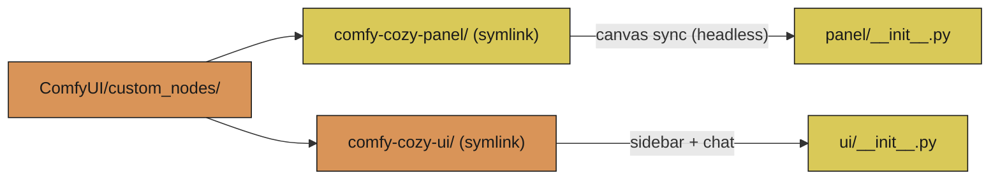

**Both symlinks are required:**
- **`comfy-cozy-panel`** -- Canvas sync bridge (runs headlessly -- keeps the agent in sync with your live graph)
- **`comfy-cozy-ui`** -- The visible sidebar: chat window, quick actions, status

---

## Pick Your LLM

Comfy Cozy is **provider-agnostic**. Same 113 tools, same streaming, same vision analysis -- swap one env var.

### Anthropic (default)

```bash
# .env
ANTHROPIC_API_KEY=sk-ant-your-key-here

# Optional overrides (defaults shown):
#   AGENT_MODEL=claude-opus-4-7                  -- main loop
#   FAST_MODEL=claude-haiku-4-5-20251001         -- low-stakes triage
#   VISION_MODEL=claude-opus-4-7                 -- analyze/compare images
#   THINKING_BUDGET=4000                         -- agent reasoning budget (tokens)
#   VISION_THINKING_BUDGET=2000                  -- vision reasoning budget

# Run
agent run
```

Ships as the default with **Opus 4.7 + extended thinking + three-tier prompt caching**.
The agent runs on Opus 4.7 with a 4K reasoning budget; vision analysis (`analyze_image`,
`compare_outputs`, `suggest_improvements`) runs the same model with its own budget. Set
`FAST_MODEL` if you want to route triage / classification tools to Haiku 4.5.

### OpenAI

```bash
# Install the SDK (one time)
pip install openai

# .env
LLM_PROVIDER=openai
OPENAI_API_KEY=sk-your-key-here
AGENT_MODEL=gpt-4o           # or gpt-4o-mini for faster/cheaper

# Run
agent run
```

Full tool-use support with streaming. Works with any OpenAI-compatible endpoint.

### Google Gemini

```bash
# Install the SDK (one time)
pip install google-genai

# .env
LLM_PROVIDER=gemini
GEMINI_API_KEY=your-key-here
AGENT_MODEL=gemini-2.5-flash  # or gemini-2.5-pro

# Run
agent run
```

Function declarations mapped automatically. Supports Gemini's thinking mode.

### Ollama (fully local, no API key)

```bash
# Install Ollama: https://ollama.com
# Pull a model
ollama pull llama3.1

# .env
LLM_PROVIDER=ollama
AGENT_MODEL=llama3.1          # or any model you've pulled

# Run (no API key needed)
agent run
```

Uses Ollama's OpenAI-compatible endpoint at `localhost:11434`. Override with `OLLAMA_BASE_URL` if running remotely. **No data leaves your machine.**

### Architecture

All four providers share the same abstraction layer (`agent/llm/`):

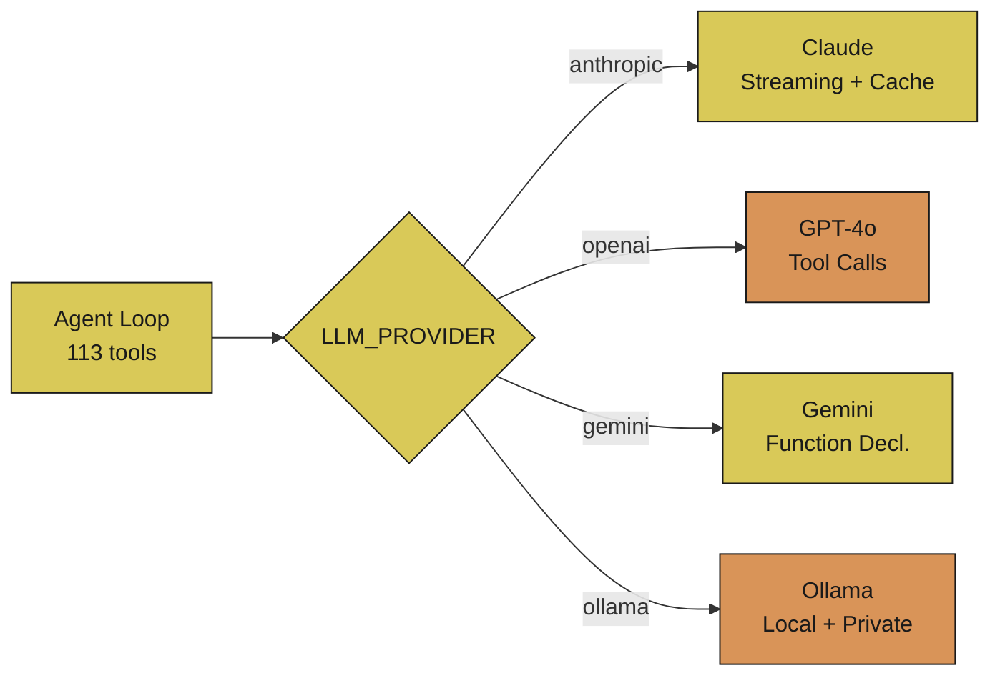

Common types (`TextBlock`, `ToolUseBlock`, `LLMResponse`), unified error hierarchy, provider-specific format conversion handled internally. Switch providers with one env var -- no code changes. All 4 providers have dedicated test suites (132 tests) plus a parameterized conformance suite that verifies protocol compliance across providers. Every `stream()` and `create()` call is instrumented with `llm_call_total` and `llm_call_duration_seconds` metrics (per-provider labels).

### Reasoning + caching (Opus 4.7)

The Anthropic path uses two Opus-4.7-specific features the other providers ignore:

1. **Extended thinking.** Every agent turn ships `thinking={"type": "enabled",
   "budget_tokens": THINKING_BUDGET}`. The streamed `ThinkingBlock`s include a
   cryptographic `signature`; we capture it and replay it on the next turn so
   tool-use loops stay valid (without the signature, Anthropic 400s the next
   request).
2. **Three-tier system prompt.** `system_prompt.build_system_prompt_blocks()`
   returns a list of cache blocks instead of one big string. Two blocks are
   marked `cache_control: ephemeral`; the third (volatile session context) is
   deliberately not cached. Combined with the last-tool cache pin, three of
   Anthropic's four cache breakpoints stay hot across a session.

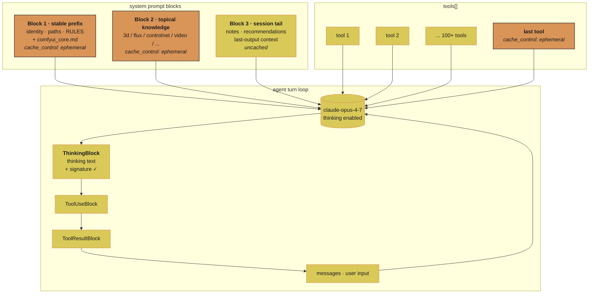

**Tone key.** Blue = blocks pinned in the prompt cache (the stable prefix, the
topical knowledge, and the last-tool breakpoint). Amber = the per-turn volatile
tail: session context, the message log, and the streaming agent loop itself.
Signature-bearing `ThinkingBlock`s are replayed verbatim on each turn so the
API accepts the next request.

---

## Three Ways to Use It

### A. Inside Claude Code / Claude Desktop (recommended)

The agent runs as an MCP server -- Claude can use all 113 tools directly.

Add this to your Claude Code or Claude Desktop MCP config:

```json
{
  "mcpServers": {
    "comfyui-agent": {
      "command": "agent",
      "args": ["mcp"]
    }
  }
}
```

Now talk to Claude about your ComfyUI workflows. It has full access.

### B. Standalone CLI

```bash
agent run                        # Start a conversation
agent run --session my-project   # Auto-saves so you can pick up later
agent run --verbose              # See what's happening under the hood
```

### C. One-click launcher (ComfyUI + agent together)

If you use the **ComfyUI CLI launcher** (`ComfyUI CLI.lnk`), Comfy Cozy is the default mode:

```
[ 1 ]  STABLE          Balanced. Works with everything.
[ 2 ]  DETERMINISTIC   Same prompt = same pixels.
[ 3 ]  FAST            Sage attention + async offload.
[ 4 ]  COMFY COZY  *   Talk to your workflow. (auto-selects in 10s)
```

Select **4** (or wait 10 seconds) -- ComfyUI starts in a background window, then the agent launches ready to talk.

### Handy CLI Commands (no API key needed)

```bash
agent inspect                    # See your installed models and nodes
agent parse workflow.json        # Analyze a workflow file
agent sessions                   # List your saved sessions
```

---

## What the Agent Knows About Your Models

The agent ships with built-in knowledge about how each model family actually behaves. It won't use SD 1.5 settings on a Flux workflow.

| Model | Resolution | CFG | Notes |
|-------|-----------|-----|-------|
| **SD 1.5** | 512x512 | 7-12 | Huge LoRA ecosystem. Negative prompts matter. |
| **SDXL** | 1024x1024 | 5-9 | Better anatomy. Tag-based prompts work best. |
| **Flux** | 512-1024 | ~1.0 (guidance) | No negative prompts. Needs FluxGuidance node + T5 encoder. |
| **SD3** | 1024x1024 | 5-7 | Triple text encoder (CLIP-G, CLIP-L, T5). |
| **LTX-2** (video) | 768x512 | ~25 | 121 steps. Frame count must be (N*8)+1. |
| **WAN 2.x** (video) | 832x480 | 1-3.5 | Dual-noise architecture. 4-20 steps. |

**The agent will never mix model families** -- no SD 1.5 LoRAs on SDXL checkpoints, no Flux ControlNets on SD3.

### Artist-Speak Translation

| You say | What the agent adjusts |
|---------|----------------------|
| *"dreamier"* or *"softer"* | Lower CFG (5-7), more steps, DPM++ 2M Karras |
| *"sharper"* or *"crisper"* | Higher CFG (8-12), Euler or DPM++ SDE |
| *"more photorealistic"* | CFG 7-10, realistic checkpoint, negative: "cartoon, anime" |
| *"more stylized"* | Lower CFG (4-6), artistic checkpoint or LoRA |
| *"faster"* | Fewer steps (15-20), LCM/Lightning/Turbo, smaller resolution |
| *"higher quality"* | More steps (30-50), hires fix, upscaler |
| *"more variation"* | Higher denoise, different seed, lower CFG |
| *"less variation"* | Lower denoise, same seed, higher CFG |

---

## How It Works

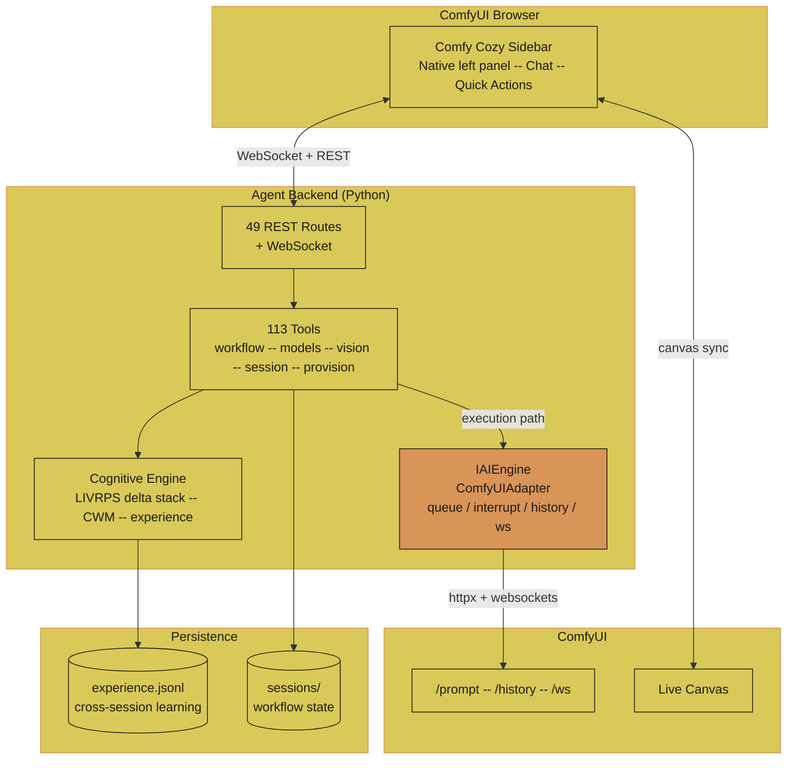

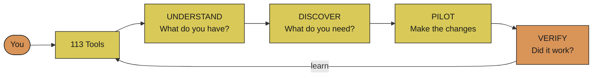

**Four phases, always in order:**

1. **UNDERSTAND** -- Reads your workflow, scans your models, checks what's installed
2. **DISCOVER** -- Searches CivitAI, HuggingFace, ComfyUI Manager (31k+ nodes)
3. **PILOT** -- Makes changes through safe, reversible delta layers (never edits your original)
4. **VERIFY** -- Runs the workflow, checks the output, records what worked

When validation finds errors, the agent **auto-repairs**. One continuous flow, no stopping to ask:

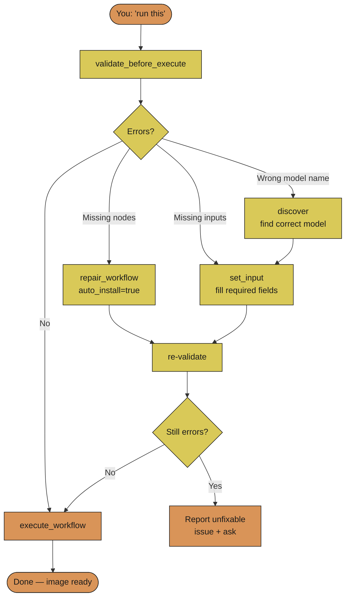

Every change is undoable. Every generation teaches the agent something. The agent is a doer, not a describer -- say "wire the model" and it wires the model. Say "repair this" and it finds the missing nodes, installs them, and validates. Say "run it" and it validates, fixes anything broken, then executes. No confirmation dialogs, no "would you like me to..." -- it acts, then tells you what it did.

### Event Triggers

Register callbacks (or webhooks) that fire automatically when ComfyUI events happen. Built into the execution pipeline -- no polling.

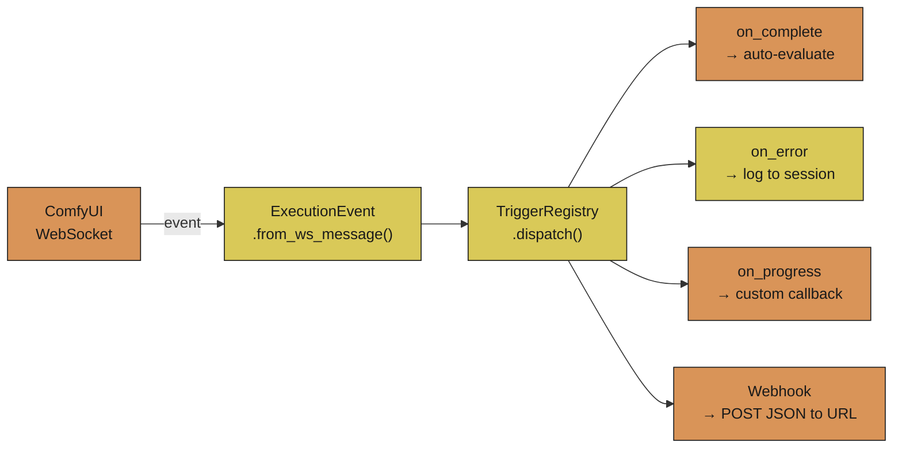

```python
from cognitive.transport.triggers import on_execution_complete, register_webhook

# Python callback
on_execution_complete(lambda event: print(f"Done in {event.elapsed:.1f}s"))

# External webhook (POSTs JSON on every execution_complete + execution_error)
register_webhook("https://your-server.com/hook", ["execution_complete", "execution_error"])
```

---

## Autonomous Mode

Write a creative intent. Hit go. No workflow file needed, no parameters to tune -- the agent composes a workflow, runs it on ComfyUI, scores the result, and learns from it automatically.

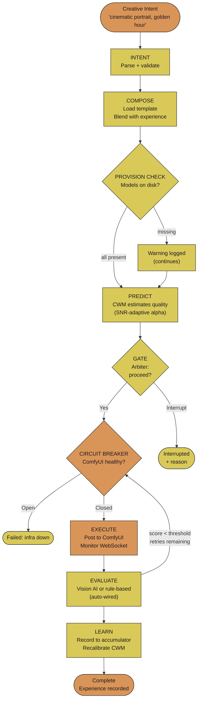

**Use from Python:**

```python
from cognitive.pipeline import create_default_pipeline, PipelineConfig

pipeline = create_default_pipeline()   # fresh accumulator, CWM, arbiter
result = pipeline.run(PipelineConfig(
    intent="cinematic portrait, golden hour",
    model_family="SD1.5",              # optional -- agent detects from intent
))
print(result.success, result.quality.overall, result.stage.value)
if result.warnings:
    print("warnings:", result.warnings)  # e.g. template family fallback
```

- **No executor required.** The pipeline calls ComfyUI directly via the real `execute_workflow` implementation.
- **Vision evaluator auto-wires.** Set `brain_available=True` and the pipeline auto-imports VisionAgent for multi-axis quality scoring (technical, aesthetic, prompt adherence). Falls back to rule-based scoring when vision is unavailable.
- **Auto-retry on low quality.** If score < threshold, adjusts parameters (steps +10, CFG nudged toward 7), and re-executes. Up to 3 attempts. Circuit breaker prevents retrying against a dead ComfyUI.
- **Provision check.** Before execution, scans for referenced models (`ckpt_name`, `lora_name`, `vae_name`). Missing models generate warnings without halting.
- **Template library.** 8 workflows: txt2img (SD 1.5 / SDXL), img2img, LoRA, multi-pass compositing (depth + normals + beauty), ControlNet depth, LTX-2 video, WAN 2.x video. Hardcoded SD 1.5 fallback if no template matches.
- **Adaptive learning.** CWM alpha blending responds to signal quality -- low variance in experience = more trust, high variance = more prior. Recalibrator adjusts confidence thresholds after every 10 predictions.
- **Experience persists across sessions -- crash-safe.** Every run saved atomically (write-to-tmp then `os.replace()`). After 30+ runs, the agent starts using your personal history to bias parameter selection.
- **Pipeline failures are graceful.** Circuit breaker, CWM exceptions, and template mismatches all produce clean `PipelineStage.FAILED` with `result.warnings`.

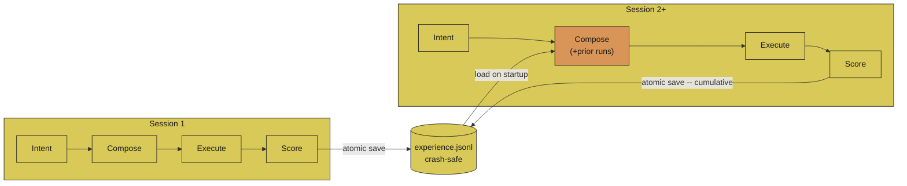

### Cozy Constitution + MoE Chain

The pipeline above runs as one shot per intent. For long-running, self-healing autonomy across many experiments, **Cozy** adds two things on top: a constitutional MoE specialist team and a bounded-failure ladder. Doctrine lives in `.claude/COZY_CONSTITUTION.md`. Specialists are in `.claude/agents/cozy-*.md`. Code in `agent/stage/constitution.py` (commandments + classifier), `agent/stage/moe_profiles.py` (specialists + chain), and `agent/harness/cozy_loop.py` (the runner).

**MoE chain** -- Article II of the constitution mandates that every state-mutating chain ends in **Scribe**. Each specialist owns one concern and produces one typed handoff artifact. The chain dispatcher (`agent/stage/moe_dispatcher.py`) routes by `TASK_CHAINS`; the default chain shown below is the full build-execute-judge-persist sequence.

```mermaid
flowchart LR
    Intent(["Intent<br/>'cinematic portrait'"]) --> Scout
    Scout["Scout<br/>recon: nodes,<br/>models, interfaces"] -->|recon_report| Architect
    Architect["Architect<br/>plan: params,<br/>graph structure"] -->|design_spec| Provisioner
    Provisioner["Provisioner<br/>fetch missing<br/>models / packs"] -->|provision_manifest| Forge
    Forge["Forge<br/>validated<br/>RFC6902 patches"] -->|build_artifact| Crucible
    Crucible["Crucible<br/>execute + verify<br/>(comfy_execute)"] -->|execution_result| Vision
    Vision["Vision<br/>judge quality<br/>(analyze_image)"] -->|quality_report| Scribe
    Scribe["Scribe<br/>save_session +<br/>record_experience"] -->|persistence_receipt| Done(["Stage flushed"])

    classDef orange fill:#d99458,color:#1a1a1a,stroke:#1a1a1a
    classDef yellow fill:#d9c958,color:#1a1a1a,stroke:#1a1a1a
    class Intent,Scout,Architect,Provisioner,Forge,Crucible,Vision,Scribe,Done yellow
```

**Self-healing ladder** -- Article III mandates that every error gets classified once by `self_healing_ladder()` and routed to one of three policies. **TERMINAL is the only path that halts**; everything else burns iteration budget and continues. This is what makes a 24-hour autonomous run survivable: ComfyUI hiccups, missing assets, and rate-limit blips never stop the loop.

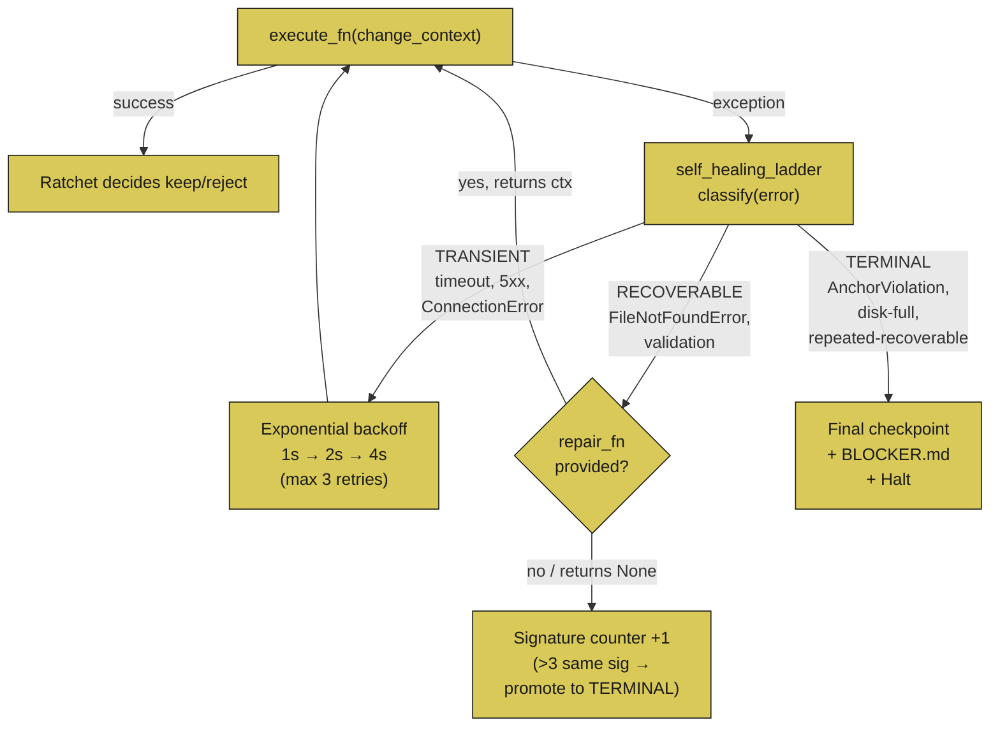

Run it: `agent autonomous --execute-mode real --workflow path/to/wf.json --hours 24`. Per-iteration checkpoint to `STAGE_DEFAULT_PATH` (atomic via `.tmp` + `os.replace`). On TERMINAL halt, `BLOCKER.md` is written with the full classification trail. See `CLAUDE.md` "Cozy Autonomous Harness" for the full CLI surface.

---

## Comfy Cozy Sidebar (Native ComfyUI Integration)

A typography-forward chat panel in ComfyUI's native left sidebar. No floating buttons, no separate windows. Uses ComfyUI's own CSS variables -- adapts to any theme automatically.

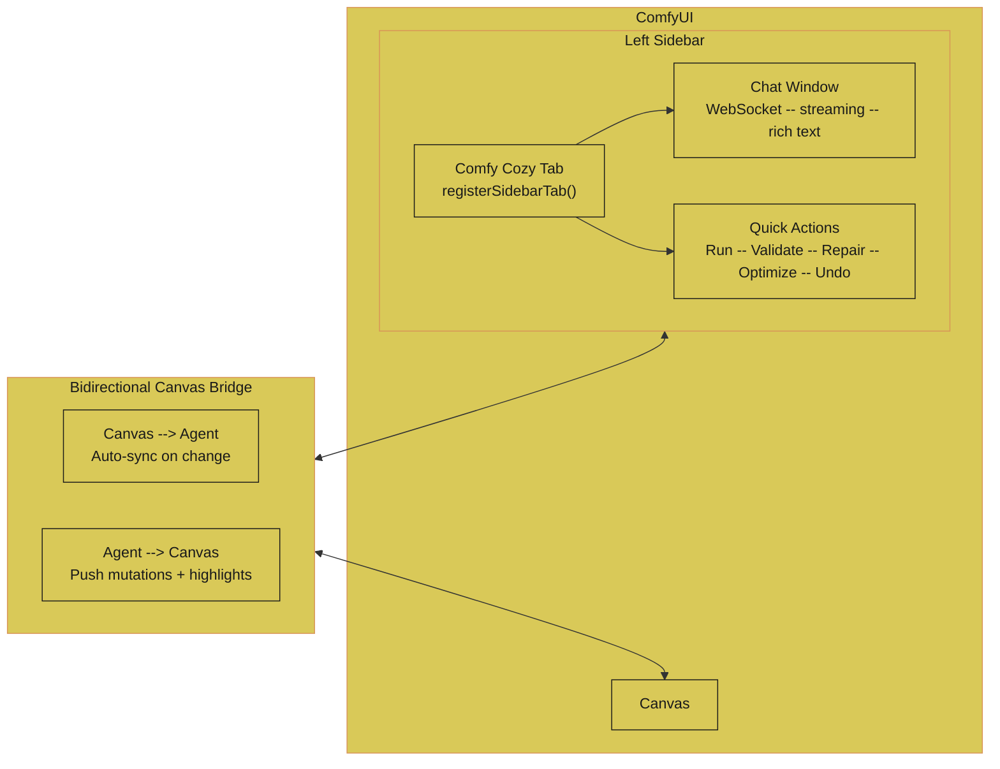

**What you get:**
- **Native sidebar tab** -- `app.extensionManager.registerSidebarTab()`, sits alongside ComfyUI's built-in panels
- **Design system v3** -- Inter + JetBrains Mono, ComfyUI CSS variables, Pentagram-inspired: hairline borders, generous whitespace, 2px radii, zero ornamentation
- **Chat** -- Auto-growing textarea, streaming responses, rich text (code blocks, bold, inline code), collapsible tool results
- **Node pills** -- Clickable inline node references, color-coded by slot type. Click = select + center on canvas.
- **Quick actions** -- Context-aware chips: Run, Validate, Repair, Optimize, Undo
- **Canvas bridge** -- Agent changes sync to canvas live with node highlighting; canvas re-syncs after each execution
- **Self-healing** -- Missing node warnings with one-click repair, deprecated node migration

**51 panel routes** expose the full tool surface: discovery, provisioning, repair, sessions, execution. (Write-back v1 added `/get-workflow-api-with-touched` and `/ack-push` to the existing 49.)

Every request passes through a three-layer security chain:

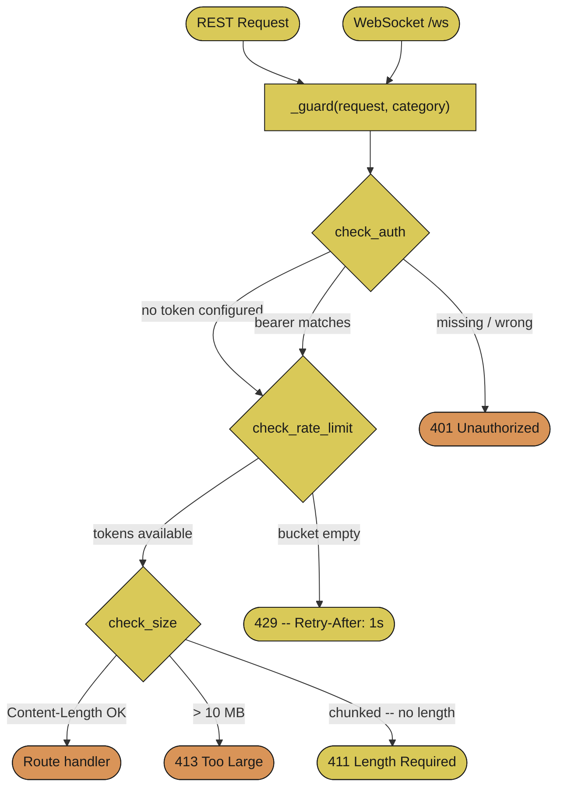

### Write-back v1 -- touched-set push to the live canvas

The canvas bridge is **bidirectional**. The canvas → agent direction has worked since launch (the panel POSTs the live graph to the agent on every change). The agent → canvas direction shipped Tier 1 only -- widget edits -- and **silently dropped every link the agent emitted** (`panel/web/js/superduperPanel.js:89-92, :106` pre-v1). Write-back v1 closes that gap with a touched-set delta-merge.

```mermaid
flowchart LR
    Event["comfy-cozy:workflow-changed<br/>(agent mutated cache)"] --> Debounce["debounce(100ms)<br/>coalesce burst events"]
    Debounce --> Run["runPushAgentToCanvas<br/>(_pushOrchestrator.js)"]
    Run --> Clear["clearDeltaFailures<br/>(L-7 lifecycle)"]
    Clear --> Fetch["GET /comfy-cozy/<br/>get-workflow-api-with-touched<br/>→ {workflow, touched}"]
    Fetch --> Pause["withObserverPause<br/>(L-6 try/finally<br/>+ refcount)"]
    Pause --> Apply["applyTouchedSet<br/>iterate touched ONLY"]
    Apply --> Kind{"entry.kind"}
    Kind -->|widget| W["widget.value = new_value"]
    Kind -->|link| L["fromNode.connect /<br/>toNode.disconnectInput"]
    Kind -->|"Tier-3 / stale /<br/>missing / malformed"| S["addDeltaFailure<br/>(P3 surface)"]
    W --> Dirty["app.canvas.setDirty"]
    L --> Dirty
    S --> Dirty
    Dirty --> Restore["observer restored<br/>(finally)"]
    Restore --> Ack["POST /comfy-cozy/ack-push<br/>(rotates server snapshot)"]

    classDef orange fill:#d99458,color:#1a1a1a,stroke:#1a1a1a
    classDef yellow fill:#d9c958,color:#1a1a1a,stroke:#1a1a1a
    class W,L,Dirty,Restore,Ack orange
    class Event,Debounce,Run,Clear,Fetch,Pause,Apply,Kind,S yellow
```

**F-1 mitigation -- touched-set diff.** The push iterates a server-computed *touched-set* (the diff between the agent's current cache and the last successfully-pushed snapshot) instead of the full workflow. Untouched canvas slots are never read or written -- director hand-edits on neighbour nodes survive every push, by construction.

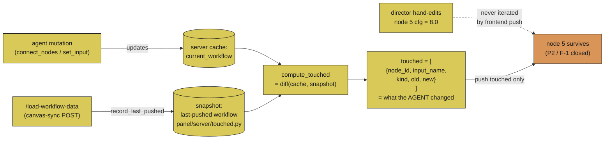

**P3 surface -- no silent drops.** Every emitted delta is either applied or routed to the panel's status bar as a "**N delta(s) not applied**" warning with a Details modal listing each entry. Six categories surface:

| Type | Trigger | Action |
|---|---|---|
| `tier3_add` | server workflow has a node the canvas doesn't | surface only -- Tier 3 deferred per SPEC |
| `tier3_delete` | canvas has a node the server doesn't | surface only |
| `stale_node_ref` | touched references a node not on canvas (and not in workflow) | surface only |
| `missing_slot` | node found, but input / widget name doesn't match | surface only |
| `malformed` | unparseable node id, unknown kind, or non-conforming shape | surface only |
| `link_rejected` | LiteGraph's `connect` / `disconnectInput` returned `false` | surface only |

**Echo + concurrency.** `withObserverPause` is module-level refcounted, so the push pauses `app.graph.onAfterChange` **exactly once** even under nested / overlapping invocations and restores in `finally` -- no echo back into the agent (P4), no observer leak (F-4), no concurrent-push race (F-5).

**Verifier stack.** 111 tests guard the contract -- **24 pytest cases** for the server-side touched-set module + **87 Vitest cases** across seven JS test files (unit, property, integration, stress, pipeline orchestrator, surface accumulator, stubs). See `harness/SHIP_REPORT.md` for predicate-by-predicate evidence and `harness/CAPSULE.md` for the F-1..F-8 verification status table.

```bash
npm install --include=dev          # one-time -- pulls Vitest
npm test                            # 87 Vitest cases (~250ms)
python -m pytest tests/test_touched.py -v   # 24 pytest cases
```

---

## One-Click Model Provisioning

The agent handles the entire pipeline from "I want Flux" to a wired workflow:

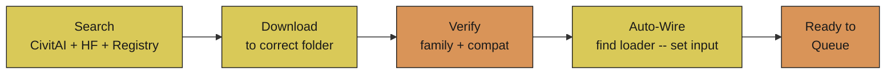

**`provision_model`** -- one tool call that discovers, downloads, verifies compatibility, finds the right loader node in your workflow, and wires the model in.

---

<details>
<summary><b>Architecture Deep Dive</b> (click to expand)</summary>

### Seven Structural Subsystems

The agent is built on seven architectural subsystems. Each one degrades independently -- if one breaks, the rest keep working.

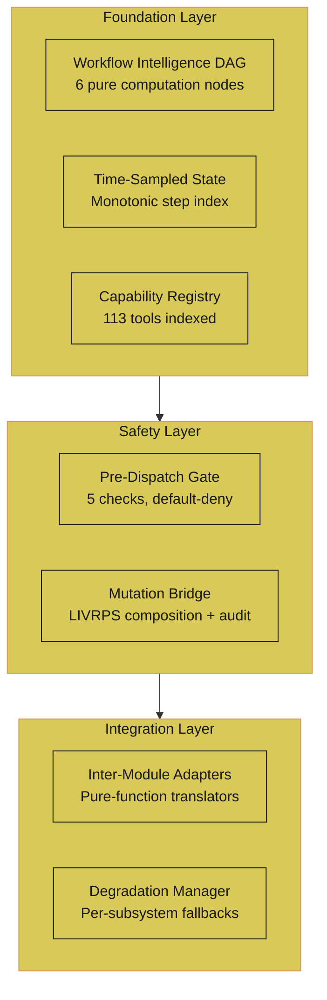

### Workflow Intelligence DAG

Before any workflow runs, a DAG of pure functions analyzes it:

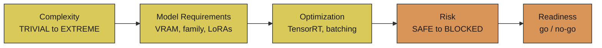

### Pre-Dispatch Safety Gate

Every tool call passes through a default-deny gate. Read-only tools bypass it (zero overhead). Destructive tools are always locked. The gate auto-detects loaded workflows AND USD stages: if either kind of workspace state exists for the current connection, mutation tools are allowed without explicit session context. Stage tools (`stage_write`, `stage_add_delta`) are recognized separately from workflow tools — a USD stage can exist independently of any loaded workflow.

```mermaid
flowchart LR
    Tool([Tool Call]) --> Type{"Stage\ntool?"}
    Type -->|No| WF{"Workflow\nloaded?"}
    Type -->|Yes| ST{"Stage\nexists?"}
    WF -->|Yes| Risk{Risk Level?}
    WF -->|No| Deny["Denied:\nno active session"]
    ST -->|Yes| Risk
    ST -->|No| Deny
    Risk -->|"Read-only"| Pass[Pass through]
    Risk -->|"Mutation / Execute"| Checks[5 safety checks]
    Risk -->|"Install / Download"| Escalate[Escalate to LLM]
    Risk -->|"Uninstall / Delete"| Block[Blocked]

    Checks --> OK{All pass?}
    OK -->|Yes| Go[Execute]
    OK -->|No| Stop[Denied + reason]

    classDef orange fill:#d99458,color:#1a1a1a,stroke:#1a1a1a
    classDef yellow fill:#d9c958,color:#1a1a1a,stroke:#1a1a1a
    class Pass,Go,Stop,Block,Deny orange
    class Escalate,Tool,Type,WF,ST,Risk,Checks,OK yellow
```

### Per-Connection Session Isolation (all 4 transports)

Every sidebar conversation, every panel chat, every MCP client connection, and every `agent run --session foo` invocation gets its own isolated `WorkflowSession` + `CognitiveWorkflowStage`. State never leaks across tabs, clients, or named sessions. Isolation is propagated via a single `_conn_session` `ContextVar` set at every entry point — and by the per-session dicts inside the four stage modules (`provision`, `foresight`, `compositor`, `hyperagent`).

```mermaid
flowchart LR
    SB["Sidebar tabs<br/>conv.id"] --> H1["_spawn_with_session<br/>(shared helper)"]
    PNL["Panel chats<br/>conv.id"] --> H1
    MCP["MCP clients<br/>conn_xxxxxxxx"] --> H2["mcp_server._handler<br/>sets _conn_session"]
    CLI["agent run --session foo<br/>(CLI)"] --> H3["cli.run<br/>+ _save_and_exit"]
    H1 --> CV[("_conn_ctx<br/>ContextVar")]
    H2 --> CV
    H3 --> CV
    CV --> WP["workflow_patch._get_state()"]
    CV --> ST["stage_tools._get_stage()"]
    CV --> FT["foresight_tools._get_*()"]
    CV --> PV["provision_tools._get_provisioner()"]
    CV --> CT["compositor_tools._scenes[sid]"]
    CV --> HY["hyperagent_tools._meta_agents[sid]"]
    WP --> WS[("Per-session<br/>WorkflowSession + Stage")]
    ST --> WS
    FT --> WS
    PV --> WS
    CT --> WS
    HY --> WS

    classDef orange fill:#d99458,color:#1a1a1a,stroke:#1a1a1a
    classDef yellow fill:#d9c958,color:#1a1a1a,stroke:#1a1a1a
    class WS orange
    class CV,WP,ST,FT,PV,CT,HY,SB,H1,PNL,MCP,H2,CLI,H3,_get_state,_get_stage,_get_provisioner,_scenes,_meta_agents yellow
```

The same connection id is also installed as the per-thread correlation ID via `set_correlation_id`, so every log entry from a single conversation is greppable end-to-end. Parallel tool calls inside a single turn inherit the contextvar via `contextvars.copy_context()` per `ThreadPoolExecutor.submit()`. And `_save_and_exit()` (called on normal exit, atexit, or SIGTERM) self-sets the contextvar before saving so the user's named session never gets corrupted with empty default workflow state.

### LIVRPS -- How Conflicts Get Resolved

All workflow changes are non-destructive layers. When two opinions conflict:

| Priority | Layer | Example |
|----------|-------|---------|
| 6 (strongest) | **Safety** | "CFG above 30 is degenerate" -- always wins |
| 5 | **Local** (your edit) | "Set CFG to 9" |
| 4 | **Inherits** (experience) | "CFG 7.5 worked better last time" |
| 3 | **VariantSets** | Creative profile presets |
| 2 | **References** | Learned recipes |
| 1 (weakest) | **Payloads** | Default template values |

Your edit beats experience. Safety beats everything. Every conflict is deterministic, transparent, and reversible.

This is an intentional inversion of USD's native LIVRPS (where Specializes is weakest). Safety is promoted to strongest for safety-critical override -- the architectural decision documented in the patent application.

### Cognitive State Engine (Phase 0.5 -- live in production)

LIVRPS is no longer a table on a slide. Since Phase 0.5 the engine is a real top-level package (`cognitive/`) installed alongside `agent/`, and `agent/tools/workflow_patch.py` imports it directly at module load -- no try/except, no silent fallback. Every PILOT mutation is recorded as a delta layer with SHA-256 tamper detection, then resolved on demand. The engine is session-scoped via the `_conn_session` ContextVar described above, so each sidebar tab and MCP connection mutates its own delta stack.

```mermaid
graph LR
    User([Tool Call<br/>via MCP]) --> WP["agent/tools/<br/>workflow_patch.py"]
    WP -->|"_get_state() reads<br/>_conn_session ContextVar"| CGE["CognitiveGraphEngine<br/>(per-session)"]
    CGE --> Stack["Delta Stack<br/>P -- R -- V -- I -- L -- S"]
    Stack -->|"sort weakest to strongest<br/>apply, preserve link arrays"| Resolved["Resolved WorkflowGraph"]
    Resolved -->|"to_api_json()"| Comfy["ComfyUI /prompt"]

    classDef orange fill:#d99458,color:#1a1a1a,stroke:#1a1a1a
    classDef yellow fill:#d9c958,color:#1a1a1a,stroke:#1a1a1a
    class User,Resolved,Comfy orange
    class WP,CGE,Stack,_get_state,to_api_json yellow
```

The `cognitive/` package is layered by phase -- the core engine (Phase 1) is fully tested at 54/54 adversarial cases. Phase 6 is complete: the autonomous pipeline is fully wired with real executor, template loading, rule-based evaluator, and experience persistence.

```mermaid
graph TB
    Cognitive["cognitive/<br/>(installed top-level package)"]
    Cognitive --> Core["core/<br/>graph -- delta -- models<br/>54/54 tests passing"]
    Cognitive --> Exp["experience/<br/>chunk -- signature -- accumulator"]
    Cognitive --> Pred["prediction/<br/>cwm -- arbiter -- counterfactual"]
    Cognitive --> Trans["transport/<br/>schema_cache -- events -- interrupt"]
    Cognitive --> Pipe["pipeline/<br/>autonomous -- create_default_pipeline<br/>Phase 6 complete"]
    Cognitive --> CogTools["tools/<br/>analyze -- compose -- execute<br/>(cycle 9 deleted 5 dead modules)"]

    classDef orange fill:#d99458,color:#1a1a1a,stroke:#1a1a1a
    classDef yellow fill:#d9c958,color:#1a1a1a,stroke:#1a1a1a
    class Core,Trans,Pipe orange
    class Cognitive,Exp,Pred,CogTools yellow
```

Each delta layer carries its `creation_hash` (SHA-256 of `opinion + sorted-JSON mutations`). `verify_stack_integrity()` walks the stack and flags any layer whose `layer_hash` no longer matches its `creation_hash` -- making post-hoc tampering detectable. Link arrays (`["node_id", output_index]`) are preserved through every parse/mutate/serialize round-trip, which is the #1 failure mode in ComfyUI agents.

### LLM Provider Hardening

The agent supports four LLM providers (Anthropic, OpenAI, Gemini, Ollama). Cycles 7+18+20 closed six real bugs in the streaming, retry, and multi-turn paths, and the Opus 4.7 upgrade (commit `c61c65f`) refined the multi-turn `ThinkingBlock` policy on Anthropic. After this work, every provider correctly: extracts streaming token usage, doesn't duplicate text on retry, doesn't fire callbacks with empty content, doesn't leak reasoning into user-visible text, and handles `ThinkingBlock` correctly on multi-turn replay — Anthropic re-sends signature-bearing thinking blocks (required by the API when extended thinking runs alongside tool use), while OpenAI / Gemini / Ollama drop them (those APIs don't model replayable thinking).

```mermaid
graph TB
    Stream["_stream_with_retry<br/>(agent/main.py)"] --> Track["content_emitted = [False]<br/>per attempt — closure-captured"]
    Track --> Wrap["_wrap_safe + tracking<br/>on_text / on_thinking"]
    Wrap --> Provider{Which provider?}

    Provider -->|Anthropic| A["✓ thinking blocks preserved<br/>in _to_response (with signature)<br/>✓ empty deltas filtered<br/>✓ signature-bearing ThinkingBlock<br/>replayed verbatim in convert_messages<br/>(c61c65f — supersedes cycle 20)"]
    Provider -->|OpenAI| O["✓ stream_options=<br/>{include_usage: true}<br/>✓ ThinkingBlock skipped<br/>in convert_messages (cycle 20)"]
    Provider -->|Gemini| G["✓ thinking / text branches<br/>mutually exclusive (if/elif)<br/>✓ ThinkingBlock skipped<br/>(was sending repr as text)"]
    Provider -->|Ollama| OL["✓ stream_options=<br/>{include_usage: true}<br/>✓ ThinkingBlock pre-filtered<br/>from content list (cycle 20)"]

    Track -->|content emitted + transient error| NoRetry["RAISE — don't retry<br/>(would duplicate text in UI)"]
    Track -->|no content + transient error| Retry["Retry with backoff<br/>RateLimit / Connection / 5xx"]

    classDef orange fill:#d99458,color:#1a1a1a,stroke:#1a1a1a
    classDef yellow fill:#d9c958,color:#1a1a1a,stroke:#1a1a1a
    class A,O,G,OL,NoRetry,Retry orange
    class Stream,Track,Wrap,Provider,_to_response,convert_messages,exclusive,list yellow
```

**Cycle 20 — ThinkingBlock multi-turn bug.** When Claude 3.7+ or Claude 4 returns a `ThinkingBlock` in its response, the agent stores it in message history. On the next turn, `convert_messages` must translate that block back to the provider's native format. Before cycle 20, all 4 providers mishandled it: Anthropic sent the raw Python dataclass to the API (400 error), OpenAI silently dropped it, Gemini converted `str(ThinkingBlock(...))` to user-visible text, and Ollama sent raw objects. Fix: all providers now skip ThinkingBlock in convert_messages (the API requires a signature field we don't capture; thinking content is already delivered via the streaming `on_thinking` callback).

**Opus 4.7 evolution (c61c65f → 3261318).** The cycle-20 fix above strips `ThinkingBlock` across the board. The Opus 4.7 upgrade refined Anthropic's branch: extended-thinking responses now include a cryptographic `signature` on each thinking block, and the API requires the signature on the next turn whenever a `tool_use` block follows. `agent/llm/_anthropic.py:convert_messages` now replays signature-bearing blocks verbatim; signature-less blocks (legacy paths, manually-constructed test fixtures) are dropped — and `3261318` made that drop loud: a WARNING-level log now names the dropped content, the API constraint, and the next-turn 400 risk. The same commit extracted a `_build_thinking_kwarg` helper and made the clamp formula raise `ValueError` early when `thinking_budget > 0` and `max_tokens <= 1024` (the prior clamp produced `budget_tokens == max_tokens`, which the API rejects). OpenAI, Gemini, and Ollama retain the cycle-20 behavior; their APIs don't model replayable thinking, so the strip remains correct.

```mermaid
graph LR
    LLM["LLM Response<br/>[TextBlock, ThinkingBlock]"] --> Store["main.py:293<br/>messages.append(content)"]
    Store --> NextTurn["Next turn<br/>convert_messages()"]
    NextTurn -->|"Anthropic, signature ✓"| Replay["ThinkingBlock<br/>→ replay verbatim"]
    NextTurn -->|"Anthropic, no signature"| WarnDrop["ThinkingBlock<br/>→ drop + log.warning"]
    NextTurn -->|"OpenAI / Gemini / Ollama"| Skip["ThinkingBlock<br/>→ skip (continue)"]
    NextTurn --> Keep["TextBlock / ToolUseBlock<br/>→ convert to native format"]
    Replay --> Safe
    WarnDrop --> Safe
    Skip --> Safe["API receives only<br/>valid native blocks"]
    Keep --> Safe

    classDef orange fill:#d99458,color:#1a1a1a,stroke:#1a1a1a
    classDef yellow fill:#d9c958,color:#1a1a1a,stroke:#1a1a1a
    class Replay,WarnDrop,Skip,Keep,Safe orange
    class LLM,Store,append,NextTurn,convert_messages,skip yellow
```

The retry tracker pattern is the key insight: an `on_text("Hello ")` followed by a transient `LLMRateLimitError` USED TO retry from scratch, calling `on_text("Hello ")` again, then `on_text("world!")` — the user saw `"Hello Hello world!"` in the UI. After cycle 7, any error fired AFTER content was emitted raises immediately instead of retrying. Tested across all 4 providers via `tests/test_main.py::TestStreamRetryDuplication` + provider-specific regression tests.

### Execution Engine Adapter

The agent's **execution path** (POST `/prompt`, POST `/interrupt`, GET `/history`, WS `/ws`) routes through an abstraction layer that mirrors `agent/llm/` discipline exactly. `agent/engine/` defines an `IAIEngine` ABC with four keyword-only methods — `queue_prompt`, `interrupt`, `get_history`, `subscribe_ws` — and ships a `ComfyUIAdapter(IAIEngine)` that owns every direct HTTP/WS call to a running ComfyUI instance. `agent/tools/comfy_execute.py` delegates through `get_engine()`; the call sites it owned before (queue, poll, websocket monitoring, execution status) now translate engine exceptions back to their established string/tuple return shapes, so caller behavior is byte-for-byte identical and the existing test suite passes unchanged.

```mermaid
graph LR
    Tool["agent/tools/comfy_execute.py<br/>queue / poll / ws / status"] --> Get["get_engine()<br/>thread-safe cache<br/>env var AI_ENGINE"]
    Get --> IFace{IAIEngine}
    IFace -->|comfyui| Adapter["ComfyUIAdapter<br/>httpx + websockets<br/>circuit breaker"]
    Adapter -->|POST| P["/prompt"]
    Adapter -->|POST| I["/interrupt"]
    Adapter -->|GET| H["/history"]
    Adapter -.->|WS| W["/ws"]

    classDef orange fill:#d99458,color:#1a1a1a,stroke:#1a1a1a
    classDef yellow fill:#d9c958,color:#1a1a1a,stroke:#1a1a1a
    class Adapter,P,I,H,W orange
    class Tool,Get,IFace yellow
```

The split is deliberate: **execution operations** live behind `IAIEngine` because they're the path that a future backend (a remote queue, a hosted ComfyUI fleet, a mock for tests) would re-implement. **Introspection endpoints** (`/object_info`, `/system_stats`, `/queue` status, `/userdata`) stay as direct `httpx` calls in their existing tool modules — they're discovery-only and not part of the execution surface. Engine errors form a hierarchy that parallels the LLM error hierarchy: `EngineError` base + `EngineConnectionError`, `EngineTimeoutError`, `EngineValidationError` (carries `node_errors`), `EngineServerError` (carries `status_code`), `EngineUnavailableError` (circuit-breaker open). The `subscribe_ws` context manager yields `EngineEvent(type, data, raw)` objects plus a `__timeout__` sentinel event that lets the caller re-check its deadline without losing the connection.

### Graceful Degradation

Every subsystem has an independent kill switch. Set any of these to `0` in your `.env` to disable:

`BRAIN_ENABLED` `DAG_ENABLED` `GATE_ENABLED` `OBSERVATION_ENABLED`

All default to ON. The agent works fine with any combination disabled -- features gracefully disappear.

### Experience Loop

Every generation is an experiment. The agent tracks what worked:

- **Sessions 1-30**: Uses built-in knowledge only
- **Sessions 30-100**: Blends knowledge with what it's learned from your renders
- **Sessions 100+**: Primarily driven by your personal history

### Semantic Knowledge Retrieval

The agent ships with 12 knowledge files (1,300+ lines) covering ControlNet preprocessor selection and strength scheduling (174 lines), Flux guidance and T5 encoder tuning (172 lines), multi-pass compositing for Nuke/AE/Fusion (119 lines), video workflows, 3D pipelines, and more. Retrieval is hybrid: keyword triggers fire first (fast path), then TF-IDF semantic search fills gaps when keywords miss. Pure Python, zero external dependencies -- no vector DB required.

```mermaid
flowchart LR
    Context["Workflow context<br/>+ session notes"] --> KW{"Keyword<br/>triggers"}
    KW -->|"≥ 2 files"| Done["Load knowledge"]
    KW -->|"< 2 files"| TFIDF["TF-IDF<br/>cosine similarity"]
    TFIDF --> Merge["Union results"]
    Merge --> Done

    classDef orange fill:#d99458,color:#1a1a1a,stroke:#1a1a1a
    classDef yellow fill:#d9c958,color:#1a1a1a,stroke:#1a1a1a
    class Done orange
    class KW,TFIDF,Context,Merge yellow
```

### MiniLM Embedder (in-process semantic vectors)

`agent/embedder.py` exposes a single function — `embed(payload: str) -> list[float]` — that returns 384-dimension L2-normalized vectors from `sentence-transformers/all-MiniLM-L6-v2`. The model is lazy-loaded on first call (≈80 MB cache at `~/.cache/huggingface/hub/`) and reused thereafter; encoding latency on M-series CPU is ≈5 ms per short string after warm-up. Opt-in: requires `pip install -r requirements.txt` to pull `sentence-transformers` + the CPU-only torch wheel (`--extra-index-url https://download.pytorch.org/whl/cpu` keeps the install small for users without a GPU).

```mermaid
flowchart LR
    Text["outcome text<br/>(workflow params + result)"] --> Embed["embed(payload)<br/>lazy SentenceTransformer<br/>thread-safe cache"]
    Embed --> Vec["384-dim<br/>L2-normalized list[float]"]
    Vec --> Cos["cosine similarity<br/>(= dot product)"]
    Cos --> Neighbors["nearest-neighbor<br/>outcome retrieval"]

    classDef orange fill:#d99458,color:#1a1a1a,stroke:#1a1a1a
    classDef yellow fill:#d9c958,color:#1a1a1a,stroke:#1a1a1a
    class Embed,Vec,Cos orange
    class Text,Neighbors yellow
```

The acceptance test (`tests/embedder/test_minilm_clustering.py`) verifies the contract on a 50-outcome × 5-theme corpus: within-theme cosine averages stay above 0.4, between-theme below 0.3, separation above 0.15. A parallel control using deterministic hash-based "synthetic" vectors (the shape of the comfy-moneta-bridge's current stub) deliberately does **not** cluster — the test asserts `|within − between| < 0.05` and that both averages sit near zero. This is the contract that distinguishes a real embedder from a placeholder before the in-process Moneta migration consumes it. **`record_outcome` and the existing JSONL → bridge pipeline are not modified by this step** — the embedder is wired in as a future-ready dependency, not switched on yet.

### Tool Inventory

**113 tools reachable via the central dispatcher** (`agent/tools/__init__.py:handle()`). The dispatcher routes through TWO maps:

- `_HANDLERS` (86 entries) — tools registered via module-level `TOOLS:` lists. Loaded eagerly at import time for the intelligence + stage layers.
- `_BRAIN_TOOL_NAMES` (27 entries) — tools registered via `BrainAgent` SDK subclasses (`__init_subclass__` auto-registration in `agent/brain/_sdk.py`). Loaded lazily on first call when `BRAIN_ENABLED=true` to break import cycles.

Sum: 86 + 27 = 113. Verify the live count with:
```python
from agent.tools import _HANDLERS, _BRAIN_TOOL_NAMES, _ensure_brain
_ensure_brain()  # forces lazy brain registration
print(len(_HANDLERS) + len(_BRAIN_TOOL_NAMES))
```

| Layer | Count | Dispatch | Highlights |
|-------|-------|----------|------------|
| **Intelligence** (`agent/tools/`) | 64 | TOOLS list → `_HANDLERS` | Workflow parsing, model search (CivitAI + HF + 31k nodes), delta patching, auto-wire, provisioning, execution |
| **Stage** (`agent/stage/`) | 22 | TOOLS list → `_HANDLERS` | USD cognitive state, LIVRPS composition, predictive experiments, scene composition |
| **Brain** (`agent/brain/`) | 27 | BrainAgent SDK → `_BRAIN_TOOL_NAMES` | Vision analysis, goal planning, pattern memory, GPU optimization, artistic intent capture, iteration tracking |
| **Total** | **113** | | |

### Workflow Lifecycle

```mermaid
flowchart LR
    Load[Load] --> Validate[Validate]
    Validate --> Errors{"Errors?"}
    Errors -->|"Missing nodes"| Repair[Auto-Repair<br/>install packs]
    Errors -->|"Missing inputs"| Fix[Auto-Fix<br/>set_input]
    Errors -->|None| Analyze[DAG<br/>Analysis]
    Repair --> Validate
    Fix --> Validate
    Analyze --> Gate[Safety<br/>Gate]
    Gate --> Patch[Patch via<br/>Delta Layer]
    Patch --> Run[Run on<br/>ComfyUI]
    Run --> Check[Check<br/>Output]
    Check --> Learn[Record<br/>Experience]

    Patch -->|Undo| Validate
    Check -->|Iterate| Patch

    classDef orange fill:#d99458,color:#1a1a1a,stroke:#1a1a1a
    classDef yellow fill:#d9c958,color:#1a1a1a,stroke:#1a1a1a
    class Gate,Run,Check orange
    class Load,Repair,Fix,Analyze,Learn,Validate,Errors,Patch yellow
```

### Project Structure

```
agent/
  llm/                Multi-provider LLM abstraction (Anthropic, OpenAI, Gemini, Ollama)
  engine/             Execution-engine abstraction (IAIEngine + ComfyUIAdapter)
                      Wraps POST /prompt, POST /interrupt, GET /history, WS /ws
                      so the agent's execution path is backend-pluggable
  embedder.py         MiniLM (all-MiniLM-L6-v2) -- 384-dim L2-normalized vectors
                      Lazy-loaded, thread-safe, opt-in via requirements.txt
  tools/              63 tools -- workflow ops, model search, provisioning, auto-wire
                      workflow_patch.py wraps the cognitive engine for non-destructive PILOT
                      comfy_execute.py routes execution traffic through agent/engine/
  brain/              27 tools -- vision, planning, memory, optimization
    adapters/         Pure-function translators between brain modules
  stage/              23 tools -- USD state, prediction, composition (USD optional via [stage])
    dag/              Workflow intelligence (6 computation nodes)
  gate/               Pre-dispatch safety (5-check pipeline)
  metrics.py          Observability (Counter, Histogram, Gauge -- pure stdlib, thread-safe)
  degradation.py      Fault isolation manager
  config.py           Environment + 4 kill switches + LLM provider selection
  mcp_server.py       MCP server (primary interface)
cognitive/            LIVRPS state engine -- installed as top-level package (Phase 0.5)
  core/               CognitiveGraphEngine, DeltaLayer, WorkflowGraph (link-preserving)
  experience/         ExperienceChunk, GenerationContextSignature, Accumulator
  prediction/         CognitiveWorldModel, SimulationArbiter, CounterfactualGenerator
  transport/          SchemaCache, ExecutionEvent, interrupt, system_stats, TriggerRegistry
  pipeline/           Autonomous end-to-end orchestration
  tools/              Phase 3 macro-tools (analyze, mutate, query, compose, ...)
ui/
  __init__.py         WEB_DIRECTORY + route registration
  web/js/sidebar.js   Native left sidebar -- chat, quick actions, progress
  web/css/            Design system v3 -- ComfyUI-native CSS variables, theme-reactive
  server/routes.py    WebSocket + REST endpoints for sidebar chat
panel/
  __init__.py             WEB_DIRECTORY + route registration + sys.path injection
  server/routes.py        51 REST routes -- full tool surface (+ write-back v1 endpoints)
  server/touched.py       Per-session "last pushed" snapshot + compute_touched (F-1)
  server/chat.py          WebSocket chat handler -- clears touched session on disconnect
  web/js/                 Bidirectional canvas bridge (no visible UI -- sidebar is primary)
    _deltaFailures.js     L-7 surface-report accumulator
    _pushApplyTouched.js  L-3/L-4/L-5/L-8 apply pipeline (widget + link + surface)
    _pushControl.js       L-6 debounce + withObserverPause (module-level refcount)
    _pushOrchestrator.js  Composed push: clear → fetch → pause → apply → ack
    superduperPanel.js    Headless canvas↔agent bridge entry point
    agentClient.js        HTTP client incl. getWorkflowApiWithTouched / ackPush
    graphMode.js          GRAPH-mode panel + delta-failure status bar + modal
tests/                4,100+ pytest + 87 Vitest, all mocked, ~60s + ~250ms
  panel/                  Vitest suite for write-back v1 (sample, deltaFailures,
                          pushApplyTouched, pushControl, pushOrchestrator,
                          integration, stress + LiteGraph stubs)
  integration/        Skips cleanly when ComfyUI not running
```

### Production Hardening

| Domain | What it means |
|--------|-------------|
| **Safety** | 5-check default-deny gate. Risk levels 0-4. Destructive ops never auto-execute. |
| **Fault Isolation** | Each subsystem fails independently. Circuit breakers prevent cascading failures. `brain` (threshold=3, timeout=30s) and `comfyui_http` (threshold=5, timeout=60s) registered; `BRAIN_ENABLED=0` kill switch fully enforced in tool registry. Session isolation: each `agent mcp` process gets a unique `conn_XXXXXXXX` namespace; ContextVar set in executor thread before dispatch. Parallel tool dispatch routes through `agent.tools.handle` live module reference -- monkey-patch visible to all ThreadPoolExecutor workers. |
| **Determinism** | Pure computation DAG. Deterministic JSON. Ordinal state enums. Same input = same output. |
| **Audit Trail** | Every mutation logged: who changed what, when, and what got overridden. |
| **Security** | Bearer token auth on all routes including WebSocket — **constant-time `hmac.compare_digest`** comparison (no timing-attack leakage). **WebSocket Origin allowlist** on sidebar + panel (rejects cross-origin connects from `evil.com`; same-origin LAN browsers pass). Path traversal blocked. **`download_model` symlink-bypass guard**: resolves the full target path (parent + filename) and re-checks against `MODELS_DIR` so a planted symlink in a `Custom_Nodes` subdirectory can't escape. SSRF prevented on initial URL and every redirect hop (RFC 1918 + loopback + link-local + CGNAT rejected via DNS resolution). MCP tool errors return `isError=True` per protocol. Gate exceptions deny by default (no silent allow). 10 MB + chunked-transfer size guards. Max 20 concurrent WebSocket connections. Atomic file writes with `flush()`+`os.fsync()` before rename (session.py + workflow_patch.py). Thread-safe token bucket rate limiter. **Handler exception guard**: stream callbacks wrapped with `_wrap_safe` so a misbehaving custom renderer can't crash the agent loop. **Config sanitization**: `COMFYUI_HOST` stripped of whitespace and trailing slashes to prevent malformed URLs. |
| **Observability** | Thread-safe metrics module (`agent/metrics.py`): Counter, Histogram, Gauge. Tool call latency (p50/p99), error rates, LLM call timing, circuit breaker transitions, session counts. JSON + Prometheus text export. Health endpoint includes metrics summary. Zero external dependencies. |
| **Bounded Resources** | Intent history (100), iteration steps (200), demo checkpoints (100). No unbounded growth. |

```mermaid
graph TB
    subgraph Sec ["Security"]
        A1["Auth -- Bearer token<br/>(REST + WebSocket)"]
        A2["Rate limit -- Token bucket<br/>per category"]
        A3["Size guard -- 10 MB limit<br/>+ chunked-transfer block"]
        A4["WS cap -- 20 connections max"]
    end
    subgraph Atom ["Persistence"]
        B1["_save_lock<br/>threading.Lock"]
        B2["Write to .jsonl.tmp"]
        B3["os.replace()<br/>atomic swap"]
        B1 --> B2 --> B3
    end
    subgraph Resil ["Resilience"]
        C1["CWM exception<br/>--> PipelineStage.FAILED"]
        C2["Template mismatch<br/>--> result.warnings"]
        C3["Save failure<br/>--> non-fatal log"]
    end
    subgraph Obs ["Observability"]
        D1["Counter / Histogram / Gauge<br/>thread-safe, pure stdlib"]
        D2["tool_call_total<br/>tool_call_duration_seconds"]
        D3["get_metrics() -- JSON<br/>get_metrics_prometheus() -- text"]
        D1 --> D2 --> D3
    end

    style Sec fill:#d9c958,color:#1a1a1a,stroke:#d99458
    style Atom fill:#d9c958,color:#1a1a1a,stroke:#d99458
    style Resil fill:#d9c958,color:#1a1a1a,stroke:#d99458
    style Obs fill:#d9c958,color:#1a1a1a,stroke:#d99458

    classDef orange fill:#d99458,color:#1a1a1a,stroke:#1a1a1a
    classDef yellow fill:#d9c958,color:#1a1a1a,stroke:#1a1a1a
    class A1,A2,A3,A4,B1,B2,B3,replace,C1,C2,C3,D1,D2,D3,get_metrics,get_metrics_prometheus yellow
```

</details>

---

## Configuration

All settings live in your `.env` file:

| Setting | Default | What it does |
|---------|---------|-------------|
| `ANTHROPIC_API_KEY` | *(required for Anthropic)* | Your Claude API key |
| `OPENAI_API_KEY` | | Your OpenAI API key |
| `GEMINI_API_KEY` | | Your Google Gemini API key |
| `LLM_PROVIDER` | `anthropic` | Which LLM to use: `anthropic`, `openai`, `gemini`, `ollama` |
| `AGENT_MODEL` | *(auto per provider)* | Override the model name |
| `FAST_MODEL` | *(auto per provider)* | Model for short triage / classification (Haiku 4.5 default on Anthropic) |
| `VISION_MODEL` | *(same as `AGENT_MODEL`)* | Model for vision tools (`analyze_image`, `compare_outputs`) |
| `THINKING_BUDGET` | `4000` | Extended-thinking budget per agent turn (Anthropic Claude 4.x+ only; `0` disables; requires `max_tokens > 1024` or the call raises `ValueError`) |
| `VISION_THINKING_BUDGET` | `2000` | Extended-thinking budget for vision-tool calls (`0` disables) |
| `OLLAMA_BASE_URL` | `http://localhost:11434/v1` | Ollama server URL |
| `COMFYUI_HOST` | `127.0.0.1` | Where ComfyUI runs |
| `COMFYUI_PORT` | `8188` | ComfyUI port |
| `COMFYUI_DATABASE` | `~/ComfyUI` | Your ComfyUI folder (models, nodes, workflows) |

---

## Testing

No ComfyUI needed -- everything is mocked:

```bash
python -m pytest tests/ -v        # 4,100+ passing tests, ~70s

# Skip tests that require a real ComfyUI server or API keys
python -m pytest tests/ -v -m "not integration"
```

The `[dev]` install runs the full test suite -- no ComfyUI server or API keys required, everything is mocked. The `test_provisioner.py` tests require `usd-core` (install with `pip install -e ".[stage]"` to resolve them).

### JavaScript / panel write-back v1

The bidirectional canvas bridge runs its own Vitest suite under `tests/panel/`:

```bash
npm install --include=dev          # one-time -- pulls Vitest
npm test                            # 87 Vitest cases, ~250ms
```

The suite covers: surface-report accumulator, push-apply pipeline (widget + link), push control (`debounce` + `withObserverPause` + concurrent-pause refcount), push orchestrator (vi.fn() stubs), integration (SPEC P1-P4 oracle), and stress (100-entry batch, 50-event burst, 50-node Tier-3, slow ack, rapid sequence). See `harness/SHIP_REPORT.md` for write-back v1 details and `harness/CAPSULE.md` for the F-1..F-8 verification status table.

---

## License & Patents

**Patent Pending** | [MIT](LICENSE)

Aspects of this architecture -- including deterministic state-evolution, LIVRPS non-destructive composition, predictive experiment pipelines, and the cognitive experience loop -- are the subject of pending US provisional patent applications filed by Joseph O. Ibrahim.

This project shares structural patterns with [Harlo](https://github.com/JosephOIbrahim/Harlo), a USD-native cognitive architecture for persistent AI memory. See Harlo's [PATENTS.md](https://github.com/JosephOIbrahim/Harlo/blob/main/PATENTS.md) for patent details and grant terms.

For questions about patent licensing, commercial licensing, or enterprise arrangements:
**Joseph O. Ibrahim** -- jomar.ibrahim@gmail.com
