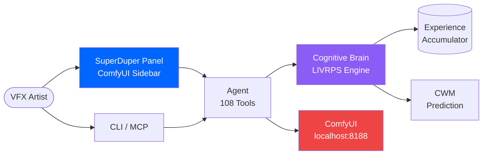
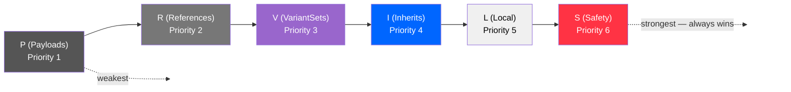
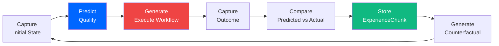
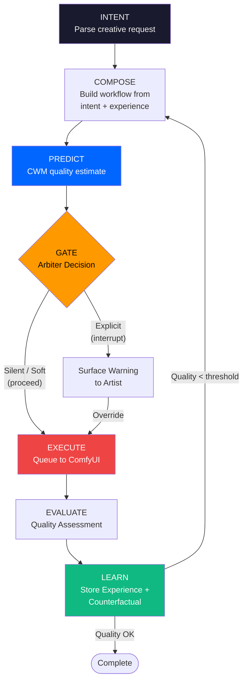
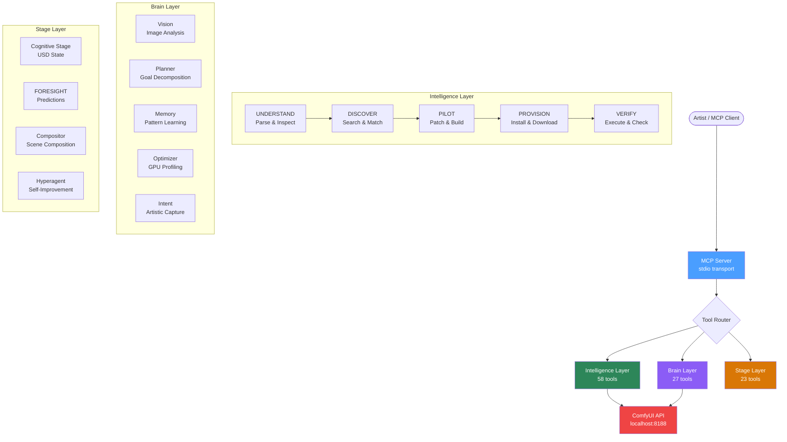
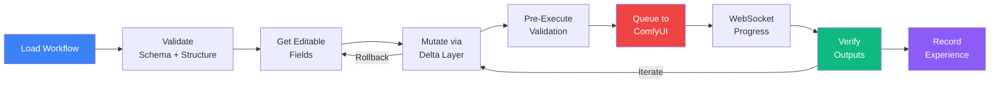
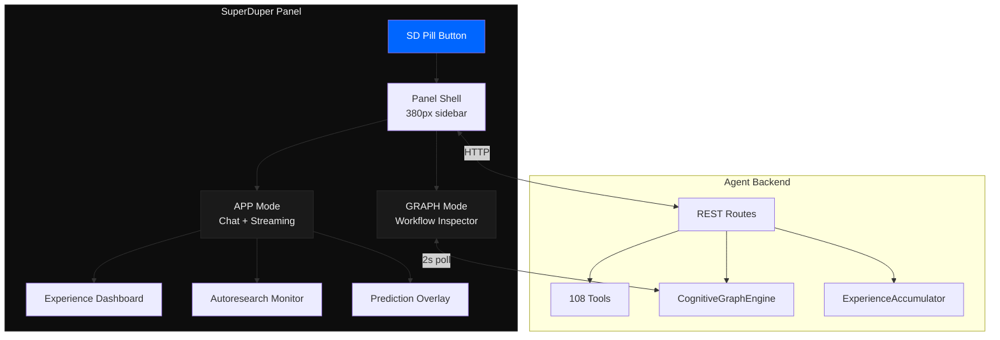
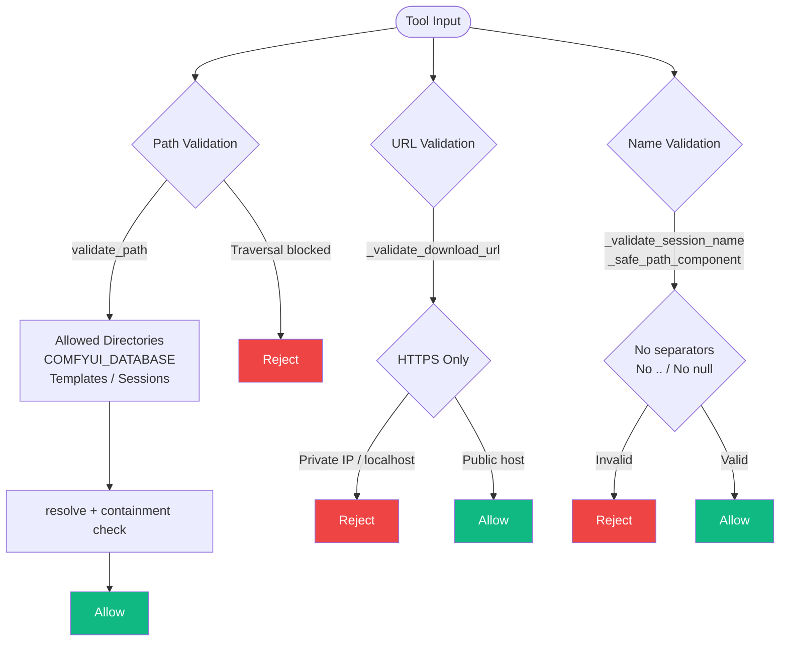

# ComfyUI Agent

**The first AI generation tool that gets better at your job by doing your job.**

AI co-pilot for [ComfyUI](https://github.com/comfyanonymous/ComfyUI) — 108 tools, a cognitive architecture that learns from every generation, and a Pentagram-inspired UI panel. Instead of manually editing JSON, hunting for node packs, or debugging broken workflows, just describe what you want.



## What It Does

- **"Cinematic portrait, golden hour, film grain"** — composes a workflow from capability matching, predicts quality, generates
- **"Load this workflow and change the seed to 42"** — reads, modifies via non-destructive delta layers, saves with full undo
- **"Repair this workflow"** — detects missing nodes, finds the packs, installs them all in one shot
- **"Reconfigure for my local models"** — scans model references, fuzzy-matches closest local alternative
- **"Download the LTX-2 FP8 checkpoint"** — downloads models directly to the correct directory
- **"Run this with 30 steps"** — patches via LIVRPS composition, validates against schema, queues to ComfyUI
- **"Analyze this output"** — Claude Vision diagnoses image issues with parameter-aware suggestions
- **"Optimize this portrait workflow overnight"** — autoresearch ratchet iterates parameters, quality only goes up

The agent gets measurably better over time. Session 1 is a capable tool. Session 100 is a capable tool that knows your style.

## Architecture

### Cognitive Brain (The Scaffolded Brain)

The agent is built on a cognitive architecture with six layers. Each layer adds capability on top of the previous:

```mermaid
graph TB
    subgraph Phase1 ["Phase 1: State Spine"]
        Engine[CognitiveGraphEngine<br/>LIVRPS Composition]
        Delta[Delta Layers<br/>SHA-256 Integrity]
        Models[ComfyNode / WorkflowGraph<br/>Typed Models]
    end

    subgraph Phase2 ["Phase 2: Transport"]
        Schema[SchemaCache<br/>Mutation Validation]
        Events[ExecutionEvent<br/>Typed WS Messages]
        Interrupt[Interrupt<br/>Mid-Execution Abort]
    end

    subgraph Phase3 ["Phase 3: Macro-Tools"]
        Analyze[analyze_workflow]
        Mutate[mutate_workflow]
        Compose[compose_workflow]
        Execute[execute_workflow]
        Research[autoresearch]
    end

    subgraph Phase4 ["Phase 4: Experience"]
        Chunk[ExperienceChunk<br/>Params → Outcome]
        Sig[ContextSignature<br/>Fast Matching]
        Acc[Accumulator<br/>3-Phase Learning]
    end

    subgraph Phase5 ["Phase 5: Prediction"]
        CWM[Cognitive World Model<br/>LIVRPS Prediction]
        Arbiter[Simulation Arbiter<br/>Silent / Soft / Explicit]
        CF[Counterfactuals<br/>What-If Experiments]
    end

    subgraph Phase6 ["Phase 6: Autonomous Pipeline"]
        Pipeline[Intent → Compose → Predict<br/>→ Execute → Evaluate → Learn]
    end

    Phase1 --> Phase2 --> Phase3
    Phase3 --> Phase4 --> Phase5 --> Phase6

    style Phase1 fill:#1a1a2e,color:#F0F0F0
    style Phase2 fill:#1a1a2e,color:#F0F0F0
    style Phase3 fill:#1a1a2e,color:#F0F0F0
    style Phase4 fill:#1a1a2e,color:#F0F0F0
    style Phase5 fill:#1a1a2e,color:#F0F0F0
    style Phase6 fill:#1a1a2e,color:#F0F0F0
```



### LIVRPS Composition

All workflow mutations are non-destructive delta layers. When opinions conflict, LIVRPS determines who wins:



- **Your edit** says CFG 9 (Local, priority 5)
- **Experience** says CFG 7.5 works better (Inherits, priority 4)
- **Safety** says CFG above 30 is degenerate (Safety, priority 6)
- Resolution: Safety overrides everything. Then your local edits. Then experience. Every conflict is deterministic, transparent, and reversible.

### Experience Loop

Every generation is an experiment with a typed result:



Three learning phases:
- **Phase 1** (0–30 generations): Prior rules only
- **Phase 2** (30–100): Blended prior + experience
- **Phase 3** (100+): Experience-dominant — the agent knows your style

### Autonomous Pipeline



## Installation

You'll need:

- **Python 3.10 or newer** (check with `python --version`)
- **ComfyUI** running on your machine (the agent talks to it over HTTP)
- **An Anthropic API key** (sign up at [console.anthropic.com](https://console.anthropic.com/))

### Step 1: Download

```bash
git clone https://github.com/JosephOIbrahim/comfyui-agent.git
cd comfyui-agent
```

### Step 2: Install

```bash
pip install -e .
```

For development (includes test tools):

```bash
pip install -e ".[dev]"
```

### Step 3: Configure

```bash
cp .env.example .env
```

Open `.env` in any text editor and add your API key:

```
ANTHROPIC_API_KEY=sk-ant-your-key-here
```

If your ComfyUI database is somewhere other than `G:/COMFYUI_Database`, also set:

```
COMFYUI_DATABASE=/path/to/your/comfyui/database
```

### Step 4: Run

Make sure ComfyUI is running first, then:

```bash
agent run
```

That's it. Type what you want in plain English. Type `quit` to exit.

## Commands

### Interactive session

```bash
agent run                             # Start chatting with the agent
agent run --session my-project        # Auto-save your progress to resume later
agent run --verbose                   # Show what's happening under the hood
```

### Offline tools (no API key needed)

```bash
agent inspect                         # See what models and nodes you have installed
agent parse workflow.json             # Analyze a workflow file
agent sessions                        # See your saved sessions
```

### Search

```bash
agent search "controlnet" --nodes           # Find node packs
agent search "KSampler" --node-type         # Which pack provides this node?
agent search "sdxl" --models                # Search model registry
agent search "flux lora" --hf              # Search HuggingFace
agent search "anime" --models --type lora   # Filter by model type
```

### Orchestration

```bash
agent orchestrate workflow.json             # Load > validate > execute > verify pipeline
agent autoresearch "flux lora"              # Multi-source model/node discovery
agent autoresearch --program program.md     # FORESIGHT autoresearch pipeline
```

## How It Works

The agent uses Claude (Anthropic's AI) with 108 specialized tools across three tiers:

### Tool Layer Architecture



**Intelligence Layer (58 tools)**

| Layer | Tools | What they do |
|-------|-------|-------------|
| **UNDERSTAND** | 13 | Parse workflows (including component/subgraph format), scan models/nodes, query ComfyUI API, detect format |
| **DISCOVER** | 15 | Search local catalog + ComfyUI Manager (31k+ nodes) + HuggingFace + CivitAI, model compatibility, install instructions, GitHub releases |
| **PILOT** | 16 | Non-destructive delta patches via CognitiveGraphEngine, semantic node ops, session persistence |
| **PROVISION** | 5 | Install node packs (git clone), download models (httpx), disable node packs, one-shot workflow repair, model reference reconfiguration |
| **VERIFY** | 9 | Schema-validated execution, WebSocket progress monitoring, post-execution verification, creative metadata embedding |

**Brain Layer (27 tools)**

| Module | Tools | What they do |
|--------|-------|-------------|
| **Vision** | 4 | Analyze generated images, A/B comparison, perceptual hashing |
| **Planner** | 4 | Goal decomposition, step tracking, replanning |
| **Memory** | 4 | Outcome learning with temporal decay, cross-session patterns |
| **Orchestrator** | 2 | Parallel sub-tasks with filtered tool access |
| **Optimizer** | 4 | GPU profiling, TensorRT detection, auto-apply optimizations |
| **Demo** | 2 | Guided walkthroughs for streams and podcasts |
| **Intent** | 4 | Artistic intent capture, MoE pipeline with iterative refinement |
| **Iteration** | 3 | Refinement journey tracking across generation cycles |

**Stage Layer (23 tools)**

| Module | Tools | What they do |
|--------|-------|-------------|
| **Provisioner** | 3 | USD-native model provisioning with download/verify lifecycle |
| **Stage** | 6 | Cognitive state read/write with delta composition and rollback |
| **FORESIGHT** | 5 | Predictive experiment planning, experience recording, counterfactuals |
| **Compositor** | 4 | USD scene composition, validation, conditioning extraction |
| **Hyperagent** | 5 | Meta-layer self-improvement proposals, calibration tracking |

## Cognitive Layer

The cognitive layer (`src/cognitive/`) adds structured learning on top of the 108 tools:

```
src/cognitive/
├── core/           # CognitiveGraphEngine, DeltaLayer, LIVRPS resolver
├── transport/      # SchemaCache, ExecutionEvent types, interrupt
├── tools/          # 8 macro-tools (analyze, mutate, compose, execute, research...)
├── experience/     # ExperienceChunk, ContextSignature, 3-phase accumulator
├── prediction/     # Cognitive World Model, Simulation Arbiter, counterfactuals
└── pipeline/       # Autonomous pipeline: intent → compose → predict → execute → learn
```

**Key properties:**
- **Non-destructive mutations** — every workflow change is a delta layer, never an in-place edit
- **SHA-256 integrity** — tamper detection on all delta layers
- **Link preservation** — `["node_id", output_index]` connection arrays survive all operations
- **Temporal decay** — recent experience weights more heavily (7-day half-life)
- **Safety overrides** — degenerate parameter combinations are blocked at the LIVRPS Safety tier
- **Graceful degradation** — if the cognitive module isn't available, tools work unchanged

## Workflow Lifecycle



## Model Profiles

The agent ships with model-specific profiles that encode real behavioral knowledge:

| Profile | Architecture | Key Insight |
|---------|-------------|-------------|
| **Flux.1 Dev** | DiT | CFG 2.5-4.5, T5-XXL encoder, negative prompts near-useless |
| **SDXL** | UNet | CFG 5-9, CLIP encoder, tag-based prompts, LoRA ecosystem |
| **SD 1.5** | UNet | CFG 7-12, 512x512 native, massive LoRA support |
| **LTX-2** | DiT (video) | CFG ~25, 121 steps, Gemma-3 encoder, frame count must be (N*8)+1 |
| **WAN 2.x** | UNet (video) | CFG 1-3.5, 4-20 steps, dual-noise architecture, CLIP encoder |

Each profile has three sections consumed by different agents:
- **prompt_engineering** (Intent Agent) — how to write prompts for this model
- **parameter_space** (Execution Agent) — correct CFG, steps, sampler, resolution ranges
- **quality_signatures** (Verify Agent) — how to judge output quality and suggest fixes

## SuperDuper Panel (ComfyUI Sidebar)

Pentagram-inspired UI panel inside ComfyUI with two modes:

**APP Mode** — Chat interface with streaming responses, tool cards, and prediction overlays
**GRAPH Mode** — Live workflow inspector showing delta layers, LIVRPS opinions per parameter, and inline editing

Plus dedicated views:
- **Experience Dashboard** — learning phase progress, quality stats, top patterns, prediction accuracy chart
- **Autoresearch Monitor** — quality trajectory, winning parameters, apply-with-one-click
- **Prediction Overlay** — inline cards when the Simulation Arbiter surfaces a recommendation



Design system: monochrome + one accent (#0066FF on #0D0D0D). Inter typography. No gradients, no shadows, 4px max radius. 1px borders. Every pixel earns its place.

## Security Model



## MCP Server (Primary Interface)

All 108 tools are available via [Model Context Protocol](https://modelcontextprotocol.io/) for integration with Claude Code, Claude Desktop, or other MCP clients:

```bash
agent mcp
```

Configure in Claude Code / Claude Desktop:

```json
{
  "mcpServers": {
    "comfyui-agent": {
      "command": "agent",
      "args": ["mcp"]
    }
  }
}
```

## Configuration

All settings go in your `.env` file:

| Setting | Default | What it does |
|---------|---------|-------------|
| `ANTHROPIC_API_KEY` | (required) | Your API key for Claude |
| `COMFYUI_HOST` | `127.0.0.1` | Where ComfyUI is running |
| `COMFYUI_PORT` | `8188` | ComfyUI port |
| `COMFYUI_DATABASE` | `G:/COMFYUI_Database` | Your ComfyUI database folder (models, nodes, workflows) |
| `COMFYUI_INSTALL_DIR` | auto-detected | ComfyUI installation directory (if separate from database) |
| `COMFYUI_OUTPUT_DIR` | auto-detected | Where ComfyUI saves generated images |
| `AGENT_MODEL` | `claude-sonnet-4-20250514` | Which Claude model to use (CLI mode only — MCP inherits from Claude Code) |

## Component Workflow Support

ComfyUI 0.16+ introduced component nodes — workflows-within-workflows where a single node on the canvas contains an entire subgraph internally. The agent handles these natively:

- **Detects** component instance nodes (UUID-style class types)
- **Parses** `definitions.subgraphs` to inspect internal node graphs
- **Validates** nodes inside components (catches missing nodes in subgraphs)
- **Supports** `COMFY_AUTOGROW_V3` dynamic inputs (dotted names like `values.a`)

## Testing

Tests run without ComfyUI — everything is mocked:

```bash
python -m pytest tests/ -v
# 2350+ tests (2140 original + 210 cognitive), all mocked, under 60 seconds
```

## Project Structure

```
comfyui-agent/
├── agent/                  # Agent package (108 tools)
│   ├── tools/              # Intelligence layer (58 tools)
│   ├── brain/              # Brain layer (27 tools)
│   ├── stage/              # Stage layer (23 tools)
│   ├── mcp_server.py       # MCP server exposing all tools
│   ├── cli.py              # CLI entry points
│   └── session_context.py  # Per-session state management
├── src/cognitive/          # Cognitive architecture
│   ├── core/               # CognitiveGraphEngine, DeltaLayer, WorkflowGraph
│   ├── transport/          # SchemaCache, ExecutionEvent, interrupt
│   ├── tools/              # 8 macro-tools
│   ├── experience/         # ExperienceChunk, signatures, accumulator
│   ├── prediction/         # CWM, Arbiter, counterfactuals
│   └── pipeline/           # Autonomous end-to-end pipeline
├── tests/                  # 2350+ tests, all mocked
├── PRODUCT_VISION.md       # What this product feels like
├── SYSTEM_DESIGN_REVIEW.md # Architecture findings (SOLID/ROUGH/BROKEN)
└── PANEL_DESIGN.md         # SuperDuper Panel component architecture
```

## Production Hardening

The codebase has been hardened across five domains:

| Domain | Changes |
|--------|---------|
| **Security** | Path traversal protection, SSRF prevention (HTTPS-only, private IP blocking), session name validation |
| **Error Handling** | Structured exception hierarchy (`AgentError` → `ToolError` / `TransportError` / `ValidationError`) |
| **Async Safety** | Blocking calls wrapped with `run_in_executor`, explicit timeouts on every HTTP call |
| **State Management** | Atomic file writes, TOCTOU race fixes, thread-safety audit across singletons |
| **Cognitive Integrity** | SHA-256 on all delta layers, LIVRPS composition with safety overrides, link preservation verified across 54 adversarial tests |

## License

[MIT](LICENSE) — use it however you want.
