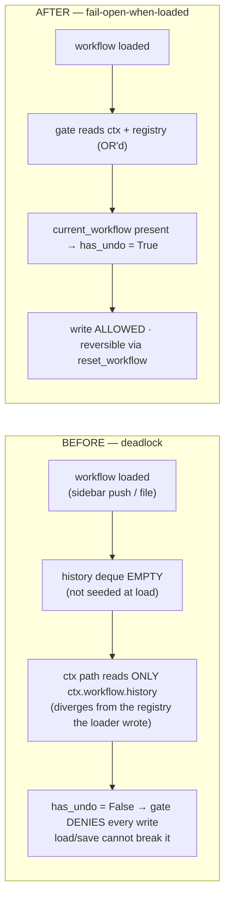

# Reversibility Gate — fail-open-when-loaded

**Fix:** `agent/tools/__init__.py` (gate `has_undo`/`session_active` computation). Commit `baf4621`.
**Scope:** `agent/gate` + `agent/tools` (non-stage). No `agent/stage/`.

The pre-dispatch gate (`agent/gate/checks.py:check_reversibility`) denies a `REVERSIBLE`
write when `has_undo` is `False`. That value is computed in `agent/tools/__init__.py`
before dispatch. Two defects made it deadlock a loaded session:

1. **Empty history at load.** A freshly-loaded session has `current_workflow` set but
   `history` is an empty deque (`workflow_patch.py:_load_workflow` / `load_workflow_from_data`
   reset it). History is only seeded *inside* a write handler — which runs *after* the
   gate. So the first write was denied, and the only code that would flip `has_undo` true
   was unreachable.
2. **ctx/registry store divergence.** With a `SessionContext` present (sidebar/MCP),
   `has_undo` was read **only** from `ctx.workflow` — a `WorkflowSession` distinct from the
   registry session the loaders actually write to. So even a successful load never reached
   the gate-visible store → permanent denial.

The advertised remedy couldn't break it: `load_workflow` is `READ_ONLY` and seeds nothing;
`save_workflow` is itself `REVERSIBLE` and so was blocked by the same check.

## Fixed gate logic

The gate now reads undo capability from **both** stores and treats a **loaded** workflow as
reversible — it can be undone via `reset_workflow`, which restores `base_workflow` (set once
at load, never touched by writes). A genuinely unloaded session still fails **closed**.

```mermaid
flowchart TD
    call["REVERSIBLE write tool<br/>set_input · apply_workflow_patch · add_node · connect_nodes · save_workflow · undo"]
    call --> read["compute undo capability from BOTH stores:<br/>ctx.workflow OR registry _get_state()"]
    read --> q{"current_workflow present<br/>in EITHER store?"}
    q -->|"yes — workflow LOADED"| open["FAIL OPEN (safe):<br/>_wf_loaded → has_undo = True, session_active = True<br/>reversible via reset_workflow → base_workflow"]
    q -->|"no — genuinely UNLOADED"| closed["FAIL CLOSED:<br/>has_undo = False → gate DENIES the write"]
    open --> allow["gate ALLOWS → write proceeds<br/>(handler seeds history for subsequent undo)"]
```

## Before → after



## Safety hinge (verified)

Fail-open is safe **because the write is reversible**:
- A fail-open write mutates **only** `current_workflow`; `base_workflow` is never touched.
- `reset_workflow` (`workflow_patch.py:_handle_reset`) restores `current_workflow =
  deepcopy(base_workflow)` and rebuilds the engine from base.
- A genuinely unloaded session (no `current_workflow` in either store) still fails closed.

`reset_workflow` is itself gate-**LOCKED** as destructive (requires explicit human
confirmation) — the intended reversibility escape hatch, not an auto-executable tool.

Verified by `tests/test_write_gate_failopen.py` (5 tests, green on the production
interpreter): loaded-can-write · unloaded-fails-closed · ctx/registry divergence resolves ·
**safety hinge: reset restores base after a fail-open write** · reset is gate-locked.
