# PRD — Latency & Wiring Optimization for Comfy-Cozy

**Author**: SYS_ENG agent (first-principles systems pass)
**Status**: Draft v1 (planning artifact)
**Goal**: Make the Comfy-Cozy system **measurably more artist-friendly for speed** by reducing the latencies the artist actually feels.

---

## 1. Context

Comfy-Cozy ships ~113 MCP tools, a long-running self-healing harness, an MoE specialist team, and an MCP server fronting all of it. The system is functionally complete (4194+ passing tests) but has never been **measured** as a system. Optimization to date has been incidental — a deepcopy here, a queue dispatcher there — not a coordinated attack on the latencies the artist sees.

This PRD scopes a coordinated attack. It defines what "speed" means for the target audience (VFX artists, not engineers), the measurement infrastructure required to attack it, the governance that gates the attack, and the Cozy MoE chain that executes it autonomously.

### What "artist-friendly speed" means (target audience axiomatic)

Per `CLAUDE.md` ("Audience: Lighting TDs, compositors, texture artists — NOT engineers"), three latencies matter:

| Latency | What the artist experiences | Current (estimated) |
|---|---|---|
| **TTFAct** — time to first action | "I typed; the agent is doing something visible" | 1–3 s |
| **TTFI** — time to first image | "I pressed go; ComfyUI is rendering" | 5–15 s + render |
| **TTNI** — time to next iteration | "Image is done; I can ask for the next change" | 2–8 s |

These are the metrics that govern artist flow state. Everything else is microbench territory unless it visibly reduces one of these three.

---

## 2. Goals (measurable success criteria)

### 2.1 Primary metrics

| ID | Metric | Baseline (placeholder until measured) | Target | Hardware |
|---|---|---|---|---|
| **L1** | `tool_call.p50` — median MCP tool-call latency | TBD | ≤ 5 ms | Threadripper PRO 7965WX |
| **L2** | `tool_call.p95` — 95th percentile MCP tool-call latency | TBD | ≤ 50 ms | same |
| **L3** | `validate_before_execute.p50` | TBD | −40% from baseline | same |
| **L4** | `execute_workflow.p50` (ComfyUI roundtrip overhead, excluding render) | TBD | ≤ 100 ms | same |
| **L5** | `cozy_loop.iteration.p50` | ~22 ms/iter (observed in soak test) | ≤ 10 ms/iter | same |
| **L6** | `agent_run.startup_p50` — `agent run` cold-start to first prompt | TBD | ≤ 500 ms | same |
| **L7** | `mcp_server.startup_p50` — `agent mcp` cold-start to ready | TBD | ≤ 800 ms | same |

### 2.2 Secondary metrics (no regression budget: −2% max)

- `cozy_loop.mem_peak_mb` after 1000 iterations
- `stage.dispatch_drops` per second under sustained load
- `validate_path.p50` (called on every tool that touches the filesystem)
- `to_json.p50` (called on every tool return)

### 2.3 Negative-space goals (must NOT regress)

- All 4194+ unit tests pass.
- `cozy_loop` integration soak (1k iterations) stays leak-free.
- Moneta E2E round-trip stays under 1 second.
- No behavior change: same inputs → same outputs (Article III of the Latency Constitution).

---

## 3. Non-goals

- **ComfyUI render speed**: Not our domain. The TensorRT optimizer (`agent/brain/optimizer.py`) handles this separately.
- **LLM provider speed**: Switching from Claude to GPT-4o-mini changes cost/latency tradeoffs but isn't a Cozy concern.
- **GPU memory tuning**: Out of scope for this PRD; the OptimizerAgent handles VRAM.
- **Micro-optimizations under 100 µs**: Per Article V (Profile-or-it-didn't-happen), these are not measurable as artist-visible improvements.
- **Refactoring for "cleanliness"**: Per Article VII of the COZY_CONSTITUTION (radical simplicity), only optimization-justified changes land.

---

## 4. First-principles latency model

### 4.1 Where the time goes (hypothesized, to be confirmed by measurement)

```
Artist types → MCP receives → Tool dispatched → Tool executes → Result serialized → MCP returns
└─ ~0 ms ──┴── ~1–3 ms ──┴── ~0.5–2 ms ──┴── 1 ms – 60 s ──┴── ~0.5–5 ms ──┴── ~1–3 ms ──┘
```

Of these, the **fixed overhead** (everything except the tool execution itself) sums to ~5–15 ms per call. For an artist who triggers 30 tool calls in a session, that's ~300 ms of pure plumbing.

The **per-call hot spots** (cited from observed code):

| Hot spot | File:line | Observation |
|---|---|---|
| `httpx.Client()` constructed per call | `agent/mcp_server.py:113`, `agent/health.py:93`, `agent/engine/comfyui_adapter.py:105,159,191`, `agent/stage/provisioner.py:288`, `agent/tools/comfy_discover.py:1159,1280` | TCP handshake + TLS setup per request. Zero connection pooling. |
| `to_json(sort_keys=True)` per tool return | `agent/tools/_util.py` | O(N log N) per call where N = tool result size. |
| Workflow `deepcopy` per undo snapshot | `agent/tools/workflow_patch.py` (11 sites, MoE-R5 only fixed preview) | O(W) per call where W = workflow size. |
| USD `Flatten().Export()` per checkpoint | `agent/stage/cognitive_stage.py:flush` | O(stage_size) where stage grows monotonically with iteration count. |
| Subscriber queue dispatch | `agent/stage/cognitive_stage.py:_dispatch_loop` | Single thread, max 10k queue. Under 10k+ events/s, drops with WARN. |
| Brain SDK lazy load | `agent/tools/__init__.py:_ensure_brain` | First brain tool call pays full import cost. |
| Module-level imports at startup | `agent/cli.py`, `agent/mcp_server.py` | Heavy imports (anthropic SDK, mcp, usd-core) happen at process start. |

### 4.2 Wiring topology issues (independent of per-call cost)

- **No httpx client pooling**: 8+ sites construct fresh clients per call.
- **No prepared-prompt cache**: system prompt built from scratch each session.
- **No WebSocket reuse**: ComfyUI execution path opens fresh WS per call (`comfy_execute.py`).
- **Brain SDK cold-load on first call**: artists doing rapid iteration pay this in their first interaction.
- **Capability registry built lazily**: first `discover` call pays the build cost.
- **Cognitive stage Flatten() per flush**: grows super-linearly across a long harness run.

---

## 5. Measurement infrastructure (new)

### 5.1 `agent/perf/` layout

```
agent/perf/
  __init__.py
  baseline.py          # canonical baseline-capture entry points
  benchmark.py         # one-shot benchmark runner with p50/p95/p99
  profile.py           # cProfile + py-spy wrapper
  baselines/           # JSONL: one per operation, one line per measurement
    tool_call.jsonl
    execute_workflow.jsonl
    cozy_loop.iteration.jsonl
    ...
  traces/              # flamegraph SVGs + cProfile dumps
    .gitignore         # contents are local-only (large binary)
```

### 5.2 New MCP tools (callable by every Cozy specialist)

| Tool | Purpose | Signature |
|---|---|---|
| `benchmark_tool` | Run N invocations of a target, return p50/p95/p99 + mem | `(name, input, n=30, warmup=3) → measurement_report` |
| `profile_tool` | Generate cProfile or py-spy trace for one call | `(name, input, profiler='cprofile') → trace_path` |
| `compare_baselines` | Diff two baselines, compute improvement % | `(baseline_a, baseline_b) → comparison` |
| `latency_baseline` | Capture full baseline pass across the canonical operation set | `() → baseline_set` |

These are NEW intelligence-layer tools registered through the existing `_HANDLERS` dispatcher. They join the 113 existing tools and are usable by:

- The `cozy-profiler` specialist (its primary instruments)
- The `cozy-architect` specialist (to verify hypotheses pre-proposal)
- The `cozy-crucible` specialist (to validate before-vs-after)
- Direct CLI / MCP clients

### 5.3 Canonical operation set (the things we measure)

These 8 operations form the **canonical baseline set**. Every PR that affects latency must rerun this set and post the comparison:

1. `tool_call:get_node_info` — small-result tool (sub-ms target)
2. `tool_call:get_all_nodes` — large-result tool (lists every node)
3. `tool_call:discover:flux` — network-bound tool (CivitAI/HF)
4. `tool_call:validate_workflow:sd15_portrait` — validation roundtrip
5. `execute_workflow:sd15_minimal` — full workflow execute (with synthetic ComfyUI)
6. `cozy_loop:iteration:dry-run` — harness per-iter cost
7. `agent_run:startup` — CLI cold-start
8. `mcp_server:startup` — MCP server cold-start

### 5.4 Long-running harness as latency lab

The `cozy_loop` harness already exists and supports `--execute-mode real`. For latency work, add a `--target latency` mode:

```bash
agent autonomous --execute-mode real --workflow tests/fixtures/sd15_portrait.json \
                 --hours 1 --max-experiments 1000 \
                 --target latency \
                 --session perf_run_$(date +%s)
```

In `--target latency` mode the harness:
- Times every `execute_fn` call (existing instrumentation)
- Tracks p50/p95/p99 in a rolling 100-sample window
- Records to `agent/perf/baselines/cozy_loop.iteration.jsonl` per checkpoint
- Reports drift over the run (drift > 10% triggers an investigation event)

---

## 6. Governance: the Latency Constitution v1

See `.claude/LATENCY_CONSTITUTION.md` for the full text. Eight articles:

| Art | Rule |
|---|---|
| I | Measurement precedes mutation |
| II | Regression budget: ≥10% gain, ≤2% adjacent regression, ≤1.5× mem |
| III | Same outputs (no behavior change) |
| IV | Concurrency-safety bar (4-thread × 1000-call contention bench) |
| V | Profile-or-it-didn't-happen (no microbench without context) |
| VI | Adversarial worst-case (worst input must also be measured) |
| VII | Atomic commits with `[HARDEN:WS-N]` tag + before/after metrics in body |
| VIII | Hardware honesty (every number names the box it ran on) |

The Self-healing ladder from the parent constitution inherits unchanged.

---

## 7. Orchestrator: the MoE chain for latency

The existing 7 Cozy specialists are extended with one new specialist:

### 7.1 New specialist: `cozy-profiler`

See `.claude/agents/cozy-profiler.md` for the full role spec. Summary:

- **Owns**: baseline capture, profile traces, microbenchmarks, p50/p95/p99 computation, worst-case input search.
- **Cannot**: modify code, propose optimizations, judge design.
- **Tools**: Bash, Read, Grep, Glob — read-only authority.
- **Handoff artifact**: `measurement_report`.

### 7.2 The latency chain

```
intent → scout → profiler(baseline) → architect → forge → crucible → profiler(verify) → vision → scribe
```

Double profiler invocation — once for baseline (before architect proposes), once for verification (after forge applies). The Vision specialist then judges the delta against the constitution.

See `.claude/commands/latency-cycle.md` for the dispatcher.

### 7.3 Slash command

```
/latency-cycle <operation-name | hot-path-description>
```

Drives one full chain pass. Example:

```
/latency-cycle execute_workflow.p50 (current 142ms, target -40%)
```

---

## 8. Concrete optimization targets (ranked by expected ROI)

These are **hypotheses to be tested**, not pre-approved fixes. Per Article I, none lands without a measurement. The score is `(expected_impact_pct × confidence) / effort`.

### Tier 1 (score ≥ 6)

| # | Target | Hypothesis | Site | Score |
|---|---|---|---|---|
| O1 | **Pooled httpx client** | Reuse one `httpx.Client(transport=httpx.HTTPTransport(retries=0))` per process; eliminate TCP/TLS handshake per call | 8 sites listed in §4.1 | **9** |
| O2 | **WebSocket reuse for ComfyUI exec** | Maintain one persistent WS connection per session; reuse across executions | `agent/tools/comfy_execute.py` | **8** |
| O3 | **Prepared system prompt cache** | Build the agent's system prompt once per session, not per call | `agent/system_prompt.py` | **7** |
| O4 | **Brain SDK prewarm** | Optionally prewarm brain on `agent run` startup (configurable via env var) | `agent/tools/__init__.py:_ensure_brain` | **6** |
| O5 | **Capability registry eager build** | Build the registry at module import time (it's small); eliminate lazy-build penalty on first `discover` | `agent/tools/__init__.py:_ensure_capabilities` | **6** |

### Tier 2 (score 4 – 5.99)

| # | Target | Hypothesis | Score |
|---|---|---|---|
| O6 | **`to_json` fast path** | For small results (< 256 bytes), skip sort_keys reorder; emit as-is | **5** |
| O7 | **`validate_path` LRU cache** | Cache results for repeat paths; invalidate on `_BLOCKED_PREFIXES` change | **5** |
| O8 | **Compile-once regex in `validate_path`** | Hoist compiled patterns to module-level constants | **5** |
| O9 | **Workflow undo via diff snapshots, not full deepcopy** | Store JSON-patch diffs instead of full workflow copies (1 fix; 10 sites remain) | **4** |
| O10 | **Stage Flatten() incremental** | Only flatten layers that changed since last flush; cache flattened tree | **5** (high effort) |

### Tier 3 (file as issues; only ship if cheap)

| # | Target | Score |
|---|---|---|
| O11 | Replace `json.dumps(sort_keys=True)` with `msgspec.json.encode` (10× faster) | 3 |
| O12 | Subscriber dispatch via `lock-free queue.SimpleQueue` | 3 |
| O13 | Eager-import the agent module set during MCP server init | 3 |
| O14 | Cache `get_node_info` results (per-process, invalidated on ComfyUI restart) | 3 |

### Explicit non-starters (rejected pre-emptively under the constitution)

- Replacing the entire MCP framework with a custom wire protocol (Article III: same outputs)
- C extension for hot loops (effort vs. impact unfavorable; Python is not the bottleneck)
- Async/await rewrite of synchronous tools (out of scope; would break the SYS_ENG constraint)

---

## 9. Verification plan

### 9.1 Per-optimization (every PR)

```bash
# Before/after measurement using new MCP tools
agent benchmark_tool --name execute_workflow --workflow tests/fixtures/sd15_portrait.json --n 30
agent benchmark_tool --name execute_workflow --workflow tests/fixtures/sd15_portrait.json --n 30 \
  --after-fix-applied
agent compare_baselines --before baselines/before.jsonl --after baselines/after.jsonl

# Constitution gate
python -m pytest tests/ -q             # 4194+ pass
ruff check agent/ tests/               # clean
python -m pytest tests/perf/ -v        # all perf benches pass

# Concurrency-safety check (Article IV)
python -m agent.perf.contention --tool execute_workflow --threads 4 --calls 1000
```

### 9.2 Per-phase (after each optimization tier lands)

```bash
# Re-baseline the canonical operation set
agent latency_baseline --tag "tier1-complete"

# Soak (Article I durability)
python -m pytest tests/integration/test_cozy_soak.py -v

# E2E artist experience smoke
agent run -v   # measure: TTFAct, TTFI, TTNI manually
```

### 9.3 Batched-PR protocol (per §13.3)

When Tier-1 (O1–O5) ships as a single batched PR:

1. Each optimization is implemented as a **separate commit** on the batch branch, in priority order O1 → O5.
2. Each commit's body contains its own before/after JSONL receipt + worst-case measurement (Article VI).
3. The Crucible specialist runs the full test suite **after each commit**, not just at the end. A test regression on commit N halts the batch at commit N−1 and the offending commit is dropped (`git reset --hard HEAD~1` on the local branch — permitted under the Cozy Git Authority Map's per-call-approval tier; coordinated through the slash command).
4. Vision judges each commit independently against the constitution. Any individual `reject` verdict drops that commit; the batch continues with the remainder.
5. The final PR description tabulates the kept vs. dropped optimizations with reasons.

This preserves the speed of one-PR review while keeping the constitutional gate per-optimization.

### 9.4 Phase exit criteria

A phase exits when:
- All in-tier optimizations either landed or rejected by the constitution.
- The canonical baseline set shows the targeted L1–L7 metrics within their targets.
- No regression on the secondary metrics or test suite.

---

## 10. Phased rollout

| Phase | Scope | Duration estimate | Exit metric |
|---|---|---|---|
| **P0** | Measurement infra (§5) + Cozy Profiler + Latency Constitution + slash command | 1 PR | `/latency-cycle` runs end-to-end on a single target |
| **P1** | Tier-1 optimizations O1–O5 (highest ROI, lowest risk) | **1 batched PR** — per §13.3 | L1 ≤ 5 ms, L4 ≤ 100 ms |
| **P2** | Tier-2 optimizations O6–O10 | 1 batched PR (or split if any single item exceeds 400 LOC) | L5 ≤ 10 ms/iter, L3 −40% |
| **P3** | Tier-3 conditional ships if any clears the constitution bar | 0–4 PRs | n/a (opportunistic) |
| **P4** | Stage Flatten() compaction (multi-day, deferred from prior reviews — see Tier 4 of COZY_CONSTITUTION work) | 1 PR | Stage flush p50 stays flat across 10k-iter run |

---

## 11. Risks and mitigations

| Risk | Likelihood | Mitigation |
|---|---|---|
| Optimization that improves median regresses worst-case | High | Article VI mandates worst-case measurement; Vision specialist enforces |
| Concurrency hazard from pooled httpx client | Medium | Article IV concurrent-call benchmark required |
| Behavior change goes undetected | Medium | Full test suite gate (4194+ tests); fuzz tests in `tests/perf/` |
| Measurements vary across hardware | High (will happen) | Article VIII: every number names the box; baselines tagged by hardware fingerprint |
| Subscriber queue drops mask real backpressure | Low (already monitored) | `dispatch_drops` counter already exposed |

---

## 12. Out of scope (deferred, documented for future)

- **24-hour soak with latency telemetry**: belongs in nightly CI, not this PRD.
- **GPU contention modeling**: ComfyUI render time dominates; out of our hands.
- **LLM prompt caching tuning**: tracked separately under the claude-api skill.
- **Cross-process MCP tool registry**: would require new wire format; behavior-change territory.

---

## 13. Decisions (resolved 2026-06-03)

1. **Baseline hardware**: **Threadripper PRO 7965WX is the sole canonical baseline.** All `[HARDEN:WS-N]` commits report numbers from this box. Lower-spec validation is deferred to a future PRD if a user reports a regression.

2. **`/latency-cycle` registration path**: **`.claude/commands/`** — matches the existing `/cozy-cycle` pattern, is auto-promoted into the Skill tool registry (verified in this session's `<system-reminder>` skill list), and avoids splitting the slash-command surface across two directories. Best practice for this codebase: one command home, follow the established convention.

3. **Tier-1 PR sequencing**: **One batched PR (O1–O5)** after the P0 measurement PR lands. Constitution gates the batch — each optimization carries its own before/after JSONL receipt in the commit body, and any single failing item is dropped from the batch rather than blocking the others.

---

## 14. Appendix: how the harness/skills/MCP wire together

```mermaid
%%{init: {'theme':'base','themeVariables': {'primaryColor':'#0066FF','primaryTextColor':'#ffffff','primaryBorderColor':'#003eaa','lineColor':'#374151','secondaryColor':'#374151','tertiaryColor':'#1f2937','fontFamily':'monospace'}}}%%
flowchart LR
    Artist(["Artist"]) -->|"/latency-cycle X"| Slash["Slash command"]
    Slash -->|invokes| Chain["Cozy MoE chain"]
    Chain -->|"scout, architect,<br/>profiler, forge, crucible,<br/>vision, scribe"| Specialists
    Specialists -->|"benchmark_tool,<br/>profile_tool,<br/>compare_baselines"| MCP["MCP server<br/>(113 + 4 new tools)"]
    Specialists -->|"--target latency"| Harness["cozy_loop harness"]
    Harness -->|"per-iter p50/p95/p99"| Baselines["agent/perf/baselines/*.jsonl"]
    MCP -->|"profile trace"| Traces["agent/perf/traces/*.svg"]
    Baselines -->|"compare_baselines"| Vision["Vision specialist<br/>(constitutional gate)"]
    Vision -->|"accept | refine | reject"| Scribe["Scribe → commit"]
```



Every specialist has access to the same 4 new MCP tools (`benchmark_tool`, `profile_tool`, `compare_baselines`, `latency_baseline`) via the existing `_HANDLERS` dispatch. The harness and slash command are orthogonal entry points — the harness for sustained-load validation, the slash command for one-shot iteration.

---

## 15. Approval gate

This PRD is approved for execution when:

- [x] Hardware decision (§13.1) — **Threadripper PRO 7965WX, sole canonical**
- [x] Skill registration path (§13.2) — **`.claude/commands/`**
- [x] PR sequencing (§13.3) — **One batched Tier-1 PR after P0**
- [x] **P0 PR opened** — measurement infra (`agent/perf/`), 4 MCP tools (`benchmark_tool`, `profile_tool`, `compare_baselines`, `latency_baseline`), `agent perf` CLI subcommand group, 32 perf tests, smoke baseline run (sandbox-tagged per Article VIII)
- [ ] **Canonical baseline run on Threadripper** — pending Joe; replaces TBDs in §2.1
